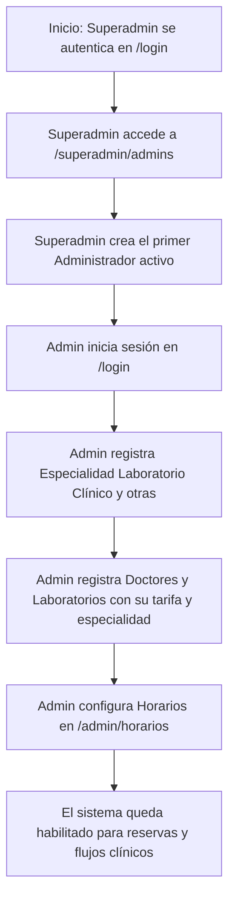

# FLUJO LÓGICO COMPLETO DEL SISTEMA

Este documento detalla la arquitectura, los flujos funcionales, la matriz de seguridad, el inventario técnico, las máquinas de estado, los recorridos cruzados de roles y las inconsistencias del sistema clínico white-label desarrollado en Laravel. Toda la información ha sido recopilada mediante la inspección directa del código fuente, modelos, migraciones y controladores.

---

## 1. Resumen del Sistema y Alcance del Análisis

El sistema es una plantilla clínica *white-label* orientada a instalaciones independientes (Single-Instance, sin multi-tenant en base de datos). Permite gestionar la operación diaria de un consultorio o clínica mediana, incluyendo la agenda de citas, expedientes clínicos estructurados, emisión de recetas, certificados médicos, procesamiento de exámenes de laboratorio y control administrativo de cobros. 

El alcance de este análisis es puramente de **inspección estática y documentación**. No se ha modificado código de la aplicación, bases de datos, ni se han ejecutado pruebas funcionales que alteren el estado.

---

## 2. Estado Inicial y Datos Creados Automáticamente

Al realizar una instalación limpia del sistema, el estado inicial de la base de datos se rige por las siguientes condiciones:

* **Roles y Permisos Creados por Seeders**: Las migraciones y seeders configuran un conjunto predefinido de roles en la tabla `roles`:
  - `superadmin`: Usuario del sistema con bypass de verificación de rol.
  - `administrador`: Responsable operativo de la clínica.
  - `doctor`: Profesional médico.
  - `paciente`: Cliente receptor de atenciones.
  - `laboratorio`: Entidad o analista encargado de procesar exámenes.
  *(Referencia: `database/seeders/RolesTableSeeder.php`)*
* **Especialidades Médicas Predeterminadas**: Se crean mediante seeders especialidades estándar (p. ej., Medicina General, Pediatría), pero **no se crea de forma automática** la especialidad "Laboratorio Clínico" a nivel de base de datos a menos que el administrador la registre o se inserte mediante un seeder específico.
  *(Referencia: `database/seeders/EspecialidadesTableSeeder.php`)*
* **Configuraciones por Defecto**: Se insertan registros de configuración global en la tabla `site_settings` (claves de horarios operativos institucionales de lunes a viernes, moneda por defecto, etc.).
  *(Referencia: `database/seeders/SiteSettingsSeeder.php`)*
* **Datos que NO existen inicialmente**: No existen cuentas de doctores, laboratorios, pacientes, horarios médicos registrados, citas programadas, recetas ni expedientes de dependientes.
* **El Único Usuario Humano**: Es el Superadministrador. Sus credenciales se configuran mediante un seeder seguro y es el punto de partida obligado para dar de alta al primer Administrador del sistema.

---

## 3. Secuencia de Habilitación desde el Superadministrador

Para habilitar una instancia vacía del sistema y llevarla hasta su estado operativo, se debe seguir la siguiente secuencia lógica:

1. **Paso 1 - Autenticación del Superadmin**: El Superadministrador inicia sesión a través del endpoint `/login`. Su menú principal está limitado únicamente a la administración de cuentas de rol `administrador` y solicitudes globales de mantenimiento.
2. **Paso 2 - Creación del Administrador**: El Superadministrador navega a `/superadmin/admins/crear` y crea un usuario con el rol exclusivo de `administrador`. El sistema valida la cédula/DNI y correo único.
   *(Evidencia: `app/Http/Controllers/Superadmin/AdminsController.php — AdminsController@store`)*
3. **Paso 3 - Registro de Especialidades**: El nuevo Administrador inicia sesión y crea las especialidades requeridas. Debe crear manualmente la especialidad `"Laboratorio Clínico"` (o `"Laboratorio Clinico"` sin tilde) si se desea dar de alta laboratorios.
   *(Evidencia: `app/Http/Controllers/Admin/AdminController.php — AdminController@usuariosStore`)*
4. **Paso 4 - Alta de Médicos y Laboratorios**: El Administrador registra doctores (asignándoles especialidades y sus tarifas de consulta `precio_consulta`) y laboratorios (asociados automáticamente a la especialidad de Laboratorio Clínico y su respectiva tarifa de examen).
5. **Paso 5 - Creación de Horarios**: El Administrador asigna los rangos de atención de los doctores en la tabla `horarios` a través de `/admin/horarios/crear` para habilitar la disponibilidad en el calendario público y del chatbot.
   *(Evidencia: `app/Http/Controllers/Admin/HorarioController.php — HorarioController@store`)*

---

## 4. Matriz de Roles, Permisos y Propiedad de Datos

El sistema implementa políticas de acceso basadas en roles y propiedad de datos mediante middlewares y la clase `UserPolicy`.

| Rol | Alcance de Lectura / Escritura | Políticas de Propiedad de Datos | Middleware Aplicado |
|---|---|---|---|
| **Superadmin** | Puede ver y modificar únicamente cuentas de rol `administrador`. No tiene acceso a datos clínicos directamente ni a modificar doctores, pacientes o laboratorios. | Restringido por `UserPolicy@manage` a interactuar únicamente con usuarios de rol `administrador`. | `role:superadmin` |
| **Administrador** | Gestión de usuarios (Doctores, Pacientes, Laboratorios), especialidades, horarios, y cobros globales. | Restringido por `UserPolicy@manage` a interactuar únicamente con usuarios de roles `['doctor', 'paciente', 'laboratorio']`. No puede modificar otros administradores ni superadmins. | `role:administrador` |
| **Doctor** | Visualización de su propia agenda, gestión de expedientes clínicos de pacientes con cita previa asignada, emisión de recetas, certificados y pedidos de laboratorio. | No puede ver la historia clínica (`ClinicalRecord`) de pacientes con los que no tenga o haya tenido una cita programada. | `role:doctor` |
| **Paciente** | Visualización y actualización de su propio perfil, registro de dependientes, agendamiento de citas propias/dependientes, carga de comprobantes de pago. | Restringido a registros donde `user_id` o `paciente_id` coincide con su ID de sesión. | `role:paciente` |
| **Laboratorio** | Acceso a órdenes y pedidos asignados para toma de muestras, subida de resultados clínicos en formato PDF. | Restringido a las órdenes asociadas a su usuario en la tabla `lab_orders` o `pedidos_laboratorio` donde el doctor/laboratorio asignado coincide con su sesión. | `role:laboratorio` |

### El Bypass del Superadministrador en Middlewares vs. Restricción de Policies
* El middleware `EnsureUserRole` otorga un bypass completo al rol `superadmin`, permitiéndole superar la barrera de ruta de cualquier rol (ej. ingresar a URLs reservadas para `administrador`).
  *(Evidencia: `app/Http/Middleware/EnsureUserRole.php — EnsureUserRole@handle`)*
* Sin embargo, este bypass **no se traduce en un acceso total**. Si el controlador invoca comprobaciones de políticas como `UserPolicy@manage` (a través de `$this->isPrivilegedAccount($user)` o directamente con `$user->can('manage', $target)`), el Superadministrador es **bloqueado de inmediato** si el usuario objetivo no es un administrador.
  *(Evidencia: `app/Http/Controllers/Admin/AdminController.php — AdminController@isPrivilegedAccount`)*
* Por lo tanto, el Superadministrador puede acceder a la interfaz y rutas de administración, pero la ejecución de mutaciones sobre pacientes, doctores o laboratorios fallará arrojando un error de autorización.

---

## 5. Inventario Funcional de Rutas y Vistas

A continuación se detalla el inventario de funciones del sistema clínico agrupadas en las 14 categorías operativas de la aplicación.

### 5.1 Área Pública
* **Bienvenida y Servicios** (`GET /` — `home.index`, `GET /servicios` — `servicios.index`):
  - *Función*: Muestra la página principal de la clínica, especialidades destacadas y tarifas.
  - *Actor*: Visitante (Público).
  - *Controlador*: `PublicPageController@welcome` y `@servicios`.
  - *Respuesta*: Blade `welcome.blade.php` y `servicios.blade.php`.
  - *Precondiciones*: Especialidades o datos de personalización cargados.
  - *Clasificación*: **Confirmado y accesible**.

### 5.2 Autenticación y Recuperación de Contraseña
* **Login Form y Autenticación** (`GET /login` — `login`, `POST /login` — `auth.login`):
  - *Función*: Muestra formulario de ingreso y procesa la sesión web del usuario.
  - *Actor*: Visitante (Público).
  - *Controlador*: `Auth\LoginController@showLoginForm` y `@login`.
  - *Respuesta*: Blade `auth.login` o Redirección al Dashboard según el rol.
  - *Validaciones*: Validaciones estándar de Laravel (`email` y `password` requeridos).
  - *Clasificación*: **Confirmado y accesible**.
* **Logout** (`POST /logout` — `logout`, `POST /salir` — `salir`):
  - *Función*: Cierra la sesión activa del usuario y limpia la caché de autenticación.
  - *Actor*: Autenticado.
  - *Controlador*: `Auth\LoginController@logout` / `PublicPageController@logout`.
  - *Respuesta*: Redirección a la página principal.
  - *Clasificación*: **Confirmado y accesible**.
* **Password Reset** (`GET /password/reset` — `password.request`, `POST /password/email` — `password.email`, `POST /password/reset` — `password.update`):
  - *Función*: Permite la solicitud de restablecimiento y el cambio de contraseña mediante enlaces por correo.
  - *Actor*: Visitante (Público).
  - *Controlador*: `Auth\ForgotPasswordController` y `Auth\ResetPasswordController`.
  - *Respuesta*: Blade `auth.passwords.email`, `auth.passwords.reset` y correos correspondientes.
  - *Clasificación*: **Confirmado y accesible**.

### 5.3 Superadministrador
* **Listado de Administradores** (`GET /superadmin/admins` — `superadmin.admins.index`):
  - *Actor*: Superadmin.
  - *Acceso*: `role:superadmin` middleware.
  - *Controlador*: `Superadmin\AdminsController@index`.
  - *Respuesta*: Blade `superadmin.admins.index.blade.php`.
  - *Campos*: Barra de búsqueda de administradores.
  - *Clasificación*: **Confirmado y accesible**.
* **Creación de Administrador** (`GET /superadmin/admins/crear` — `superadmin.admins.create`, `POST /superadmin/admins` — `superadmin.admins.store`):
  - *Actor*: Superadmin.
  - *Controlador*: `Superadmin\AdminsController@create` y `@store`.
  - *Respuesta*: Blade `superadmin.admins.create` o redirección con éxito.
  - *Validaciones*: DNI obligatorio (10 dígitos, cédula ecuatoriana válida), email único, contraseña robusta.
  - *Clasificación*: **Confirmado y accesible**.
* **Acciones de Bloqueo/Suspensión de Admins** (`PATCH /superadmin/admins/{admin}/block`, `/suspend`, `/activate`):
  - *Actor*: Superadmin.
  - *Controlador*: `Superadmin\AdminsController@block`, `@suspend` y `@activate`.
  - *Efecto*: Modifica `status` en la tabla `users` a `blocked` o `suspended` (con fecha `suspended_until` si es suspensión).
  - *Clasificación*: **Confirmado y accesible**.
* **Solicitudes de Personalización** (`GET /superadmin/solicitudes/personalizacion` — `superadmin.solicitudes.personalizacion.index`, `PATCH /superadmin/solicitudes/personalizacion/{accessRequest}/aprobar`, `/rechazar`, `/revocar`):
  - *Actor*: Superadmin.
  - *Controlador*: `Superadmin\PersonalizacionRequestController`.
  - *Respuesta*: Blade `superadmin.solicitudes.personalizacion` o redirección con éxito.
  - *Efectos*: Habilita o deshabilita la característica "personalizacion" al administrador respectivo.
  - *Clasificación*: **Confirmado y accesible**.
* **Modo Mantenimiento** (`GET /superadmin/mantenimiento` — `superadmin.maintenance.edit`, `PUT /superadmin/mantenimiento` — `superadmin.maintenance.update`):
  - *Actor*: Superadmin.
  - *Controlador*: `Superadmin\MaintenanceController@edit` y `@update`.
  - *Blade*: `superadmin.maintenance.blade.php`.
  - *Efectos*: Escribe el valor booleano de `maintenance_mode` en `site_settings`. Bloquea accesos a usuarios de rol regular.
  - *Clasificación*: **Confirmado y accesible**.

### 5.4 Administrador
* **Listado y Búsqueda de Usuarios** (`GET /admin/usuarios` — `admin.usuarios.index`):
  - *Actor*: Administrador.
  - *Controlador*: `Admin\AdminController@usuarios`.
  - *Blade*: `admin.usuarios.blade.php`.
  - *Clasificación*: **Confirmado y accesible**.
* **Registro de Usuarios** (`GET /admin/usuarios/crear` — `admin.usuarios.create`, `POST /admin/usuarios` — `admin.usuarios.store`):
  - *Actor*: Administrador.
  - *Controlador*: `Admin\AdminController@usuariosCreate` y `@usuariosStore`.
  - *Validaciones*: DNI único (10 dígitos), email único, precio de consulta obligatorio para doctor/laboratorio.
  - *Inconsistencia*: Requiere que la especialidad "Laboratorio Clínico" esté previamente configurada en base de datos si se registra un rol `laboratorio`.
  - *Clasificación*: **Confirmado y accesible**.
* **Edición y Desactivación de Usuarios** (`GET /admin/usuarios/{user}/editar`, `PUT /admin/usuarios/{user}`, `DELETE /admin/usuarios/{user}`):
  - *Actor*: Administrador.
  - *Controlador*: `Admin\AdminController@usuariosEdit`, `@usuariosUpdate`, `@usuariosDestroy`.
  - *Evidencia*: Bloquea eliminación de doctores/laboratorios si poseen citas/registros. Realiza desactivación lógica (`status = inactive`, `active = false`).
  - *Clasificación*: **Confirmado y accesible**.
* **Override de Citas** (`GET /admin/citas/override/crear` — `admin.citas.override.create`, `POST /admin/citas/override` — `admin.citas.override.store`):
  - *Actor*: Administrador.
  - *Controlador*: `Admin\CitaOverrideController@create` y `@store`.
  - *Precondiciones*: Permite saltar el bloqueo de deudas de un paciente y forzar el agendamiento manual de una cita.
  - *Clasificación*: **Confirmado y accesible**.
* **Gestión de Horarios** (`GET /admin/horarios`, `POST /admin/horarios`, `PUT /admin/horarios/{horario}`, `DELETE /admin/horarios/{horario}`):
  - *Actor*: Administrador.
  - *Controlador*: `Admin\HorarioController`.
  - *Evidencia*: Valida y previene solapamientos. Impide remover un horario si existen citas activas reservadas.
  - *Clasificación*: **Confirmado y accesible**.
* **Aprobación/Rechazo de Pagos** (`GET /admin/pagos` — `admin.pagos.index`, `POST /admin/pagos/{pago}/aprobar`, `POST /admin/pagos/{pago}/rechazar`, `POST /admin/pagos/{pago}/anular`):
  - *Actor*: Administrador.
  - *Controlador*: `Admin\PagoController`.
  - *Blade*: `admin.pagos.index.blade.php`, `admin.pagos.show` (muestra comprobante subido).
  - *Efectos*: Si aprueba, cambia estado a `pagado` y genera recibo contable. Si rechaza, estado cambia a `rechazado` y el paciente puede re-subir comprobante.
  - *Clasificación*: **Confirmado y accesible**.

### 5.5 Doctor
* **Agenda y Citas** (`GET /doctor/agenda` — `doctor.agenda`, `GET /doctor/citas` — `doctor.citas`):
  - *Actor*: Doctor.
  - *Controlador*: `Doctor\AdminController@agenda` y `CitaController@indexDoctor`.
  - *Blade*: `doctor.agenda.blade.php` y `doctor.citas.blade.php`.
  - *Clasificación*: **Confirmado y accesible**.
* **Aceptar, Rechazar y Realizar Citas** (`POST /doctor/citas/{id}/aceptar`, `/rechazar`, `/realizar`):
  - *Actor*: Doctor.
  - *Controlador*: `CitaController@aceptar`, `@rechazar` y `@realizar`.
  - *Precondiciones*: Para marcar como realizada, requiere que la nota SOAP de la cita esté en estado `firmada`.
  - *Clasificación*: **Confirmado y accesible**.
* **Notas SOAP Borrador y Firmadas** (`GET /doctor/citas/{cita}/historial-clinico` — `doctor.citas.soap`, `POST /doctor/citas/{cita}/historial-clinico` — `doctor.citas.soap.store`, `POST /doctor/citas/{cita}/historial-clinico/firmar`, `POST /doctor/citas/{cita}/historial-clinico/enmienda`):
  - *Actor*: Doctor.
  - *Controlador*: `Doctor\SoapController`.
  - *Blade*: `doctor.soap.blade.php`.
  - *Regla*: Guarda borradores de notas. La firma bloquea la nota. Enmienda genera snapshot JSON en la tabla `nota_soap_enmiendas`.
  - *Clasificación*: **Confirmado y accesible**.
* **Planificar Próxima Cita Control** (`POST /doctor/citas/{cita}/proxima/planificar` — `doctor.citas.proxima.planificada`):
  - *Actor*: Doctor.
  - *Controlador*: `CitaController@proximaPlanificada`.
  - *Efecto*: Crea una nueva cita pendiente en la agenda sin requerir pago previo.
  - *Clasificación*: **Confirmado y accesible**.
* **Gestión de Recetas** (`GET /doctor/recetas/crear/{cita}`, `POST /doctor/recetas`, `GET /doctor/recetas/editar/{cita}`, `POST /doctor/recetas/actualizar`):
  - *Actor*: Doctor.
  - *Controlador*: `Doctor\RecetaController`.
  - *Regla*: Restricción de 60 minutos para modificación activa de recetas.
  - *Clasificación*: **Confirmado y accesible**.
* **Emisión de Certificados Médicos** (`GET /doctor/citas/{cita}/certificado-medico/crear`, `POST /doctor/citas/{cita}/certificado-medico`):
  - *Actor*: Doctor.
  - *Controlador*: `Doctor\CertificadoMedicoController`.
  - *Clasificación*: **Confirmado y accesible**.
* **Pedidos de Laboratorio** (`GET /doctor/citas/{cita}/pedido-laboratorio/crear`, `POST /doctor/citas/{cita}/pedido-laboratorio`):
  - *Actor*: Doctor.
  - *Controlador*: `Doctor\PedidoLaboratorioController`.
  - *Efecto*: Registra un pedido en la tabla `pedidos_laboratorio` con estado `pendiente_toma`.
  - *Clasificación*: **Confirmado y accesible**.

### 5.6 Paciente
* **Calendario de Reservas** (`GET /paciente/crear-cita` — `paciente.crear-cita`, `POST /paciente/crear-cita` — `paciente.crear-cita.store`):
  - *Actor*: Paciente.
  - *Controlador*: `CitaController@create` y `@store`.
  - *Blade*: `paciente.crear-cita.blade.php`.
  - *Validaciones*: Restringe agendamiento si existen deudas de citas realizadas con más de 24 horas de antigüedad.
  - *Clasificación*: **Confirmado y accesible**.
* **Gestión de Dependientes** (`GET /paciente/dependientes` — `paciente.dependientes.index`, `POST /paciente/dependientes` — `paciente.dependientes.store`, `DELETE /paciente/dependientes/{dependiente}`):
  - *Actor*: Paciente.
  - *Controlador*: `DependienteController`.
  - *Validaciones*: Límite de 10 dependientes por titular. Restricción de edad (< 18 o > 65 años).
  - *Efectos*: Baja lógica del dependiente si posee historial clínico activo.
  - *Clasificación*: **Confirmado y accesible**.
* **Carga de Comprobantes de Pago** (`GET /paciente/pagos` — `paciente.pagos.index`, `POST /paciente/pagos/{pago}/enviar`):
  - *Actor*: Paciente.
  - *Controlador*: `Paciente\PagoController@index` y `@submit`.
  - *Respuesta*: Carga archivo comprobante, cambia estado de pago a `en_verificacion`.
  - *Clasificación*: **Confirmado y accesible**.

### 5.7 Laboratorio
* **Listado de Órdenes y Pedidos** (`GET /laboratorio/ordenes` — `laboratorio.ordenes.index`, `GET /laboratorio/pedidos-mvp` — `laboratorio.pedidos.index`):
  - *Actor*: Laboratorio.
  - *Controlador*: `Laboratorio\OrdenController@index` y `Laboratorio\PedidoLaboratorioController@index`.
  - *Blade*: `laboratorio.ordenes.index.blade.php` y `laboratorio.pedidos.index.blade.php`.
  - *Clasificación*: **Confirmado y accesible**.
* **Procesar Muestra y Subir Resultados** (`POST /laboratorio/pedidos-mvp/{pedido}/muestra`, `POST /laboratorio/pedidos-mvp/{pedido}/resultado`):
  - *Actor*: Laboratorio.
  - *Controlador*: `Laboratorio\PedidoLaboratorioController@marcarMuestra` y `@subirResultado`.
  - *Validaciones*: Archivo de resultado PDF obligatorio (< 5MB), resumen clínico obligatorio.
  - *Efectos secundarios*: Cambia estado a `resultado_listo`, despacha correo con el PDF adjunto al paciente.
  - *Clasificación*: **Confirmado y accesible**.

### 5.8 Chatbot
* **OTP e Interacción** (`POST /chatbot/enviar-codigo`, `POST /chatbot/verificar-codigo`, `POST /chatbot/agendar`, `POST /chatbot/cancelar`, `POST /chatbot/reagendar`):
  - *Actor*: Visitante (Público).
  - *Controlador*: `ChatBotController`.
  - *Efecto*: Valida el flujo OTP mediante caché (10 min). Bloquea slots de tiempo de forma temporal (`appointment_slot_holds` por 5 min). Realiza mutaciones directas de agendamiento y cancelación en la base de datos.
  - *Clasificación*: **Confirmado y accesible**.

### 5.9 Captcha y Contacto
* **Captcha Challenge** (`GET /captcha/challenge` — `captcha.challenge`, `POST /captcha/image/{image}` — `captcha.image.show`, `POST /captcha/verify` — `captcha.verify`):
  - *Actor*: Visitante (Público).
  - *Controlador*: `Captcha\CaptchaController`.
  - *Efectos*: Devuelve imágenes de animales para validación de sesión chatbot.
  - *Clasificación*: **Confirmado y accesible**.
* **Contacto Form** (`GET /contacto` — `contacto.form`, `POST /contacto` — `contacto.enviar`):
  - *Actor*: Visitante (Público).
  - *Controlador*: `ContactoController`.
  - *Regla*: Protección por honeypot y análisis de velocidad de envío (< 3 segundos).
  - *Clasificación*: **Confirmado y accesible**.

### 5.10 Demo Pública (Cinco Perfiles)
* **Demo Router e Intercepción** (`GET /demo` — `demo.index`, `GET /demo/admin`, `GET /demo/doctor`, `GET /demo/paciente`, `GET /demo/laboratorio`, `GET /demo/superadmin`):
  - *Actor*: Visitante (Público).
  - *Controlador*: `DemoDashboardController`.
  - *Acceso*: Middleware `demo.isolation`.
  - *Respuesta*: Carga estados temporales leídos/escritos en las variables de sesión del usuario. Bloquea escrituras reales SQL en base de datos.
  - *Clasificación*: **Confirmado y accesible**.

### 5.11 API y Endpoints Auxiliares
* **Slots de Doctor** (`GET /api/doctor/{doctor}/fecha/{fecha}/slots`):
  - *Actor*: Visitante (Público).
  - *Controlador*: `Api\DoctorSlotController`.
  - *Respuesta*: JSON con la lista de slots de 30 min libres.
  - *Clasificación*: **Confirmado y accesible**.
* **Creación de Slot Holds** (`POST /api/slot-holds`):
  - *Actor*: Visitante (Público).
  - *Controlador*: `Api\SlotHoldController@store`.
  - *Respuesta*: JSON con el token de reserva temporal.
  - *Clasificación*: **Confirmado y accesible**.
* **Tarifas de Consultas** (`GET /api/tarifa/doctor/{id}`):
  - *Actor*: Visitante.
  - *Controlador*: `Api\TarifaController@precioDoctor`.
  - *Clasificación*: **Confirmado y accesible**.

### 5.12 PDF, Excel y Descargas
* **Descarga de Recetas/Certificados** (`GET /doctor/recetas/descargar/{cita}`, `GET /paciente/certificados/{certificado}/descargar`):
  - *Actor*: Doctor / Paciente.
  - *Controlador*: `Doctor\RecetaController@download` / `Paciente\CertificadoMedicoController@download`.
  - *Respuesta*: PDF descargable.
  - *Clasificación*: **Confirmado y accesible**.
* **Verificación de Documentos** (`GET /verificar-documento` — `documentos.verificar.form`, `POST /verificar-documento` — `documentos.verificar.search`, `GET /verificar/{csv}` — `documentos.verificar.show`):
  - *Actor*: Visitante (Público).
  - *Controlador*: `DocumentoVerificacionController`.
  - *Blade*: `documentos.verificar.blade.php`.
  - *Respuesta*: Muestra el estado de validez de una receta, certificado o examen usando el hash CSV y código QR.
  - *Clasificación*: **Confirmado y accesible**.

### 5.13 Rutas Firmadas desde Correos
* **Acciones de Enlace desde Email** (`GET /email/cita/{cita}/{rol}/{accion}` — `email.cita.action`):
  - *Actor*: Destinatario del correo (Paciente / Doctor).
  - *Acceso*: Middleware `signed` (URL firmada de Laravel).
  - *Controlador*: `EmailCitaActionController`.
  - *Efecto*: Permite realizar cambios de estado en citas sin requerir una sesión web de navegador activa al momento de hacer clic en el enlace.
  - *Clasificación*: **Confirmado y accesible**.

### 5.14 Procesos sin Interfaz
* **Planificador del Sistema** (`app/Console/Kernel.php`):
  - *Actor*: Scheduler de Laravel (Sistema).
  - *Frecuencia*: 1 min, 10 min, 30 min y diario.
  - *Efectos*: Expira slots de tiempo, marca citas no-show, encola recordatorios, desactiva cuentas inactivas.
  - *Clasificación*: **Definido pero no activo** (Requiere configuración del cron daemon a nivel del servidor de despliegue).

---

## 6. Flujo Completo del Superadministrador

El Superadministrador (`superadmin`) se enfoca en tareas operativas e institucionales globales:

1. **Dashboard y Datos de Operación**:
   - Accede a `/superadmin/dashboard` y consume datos de rendimiento de servidores y estadísticas generales a través del controlador `Superadmin\DashboardController@index` y `@dashboardData`.
   - Exporta reportes globales de actividad clínica en PDF.
2. **Gestión de Administradores**:
   - Registro de nuevas cuentas administrativas en `/superadmin/admins/crear`.
   - Modificación de credenciales y perfiles de administradores activos en `/superadmin/admins/{admin}/editar`.
3. **Control del Estado de Cuentas**:
   - Bloqueo inmediato: Desactiva el acceso web de un administrador a través del endpoint `/superadmin/admins/{admin}/block`.
   - Suspensión temporal: Asigna una fecha límite (`suspended_until`) en el perfil del usuario mediante `/superadmin/admins/{admin}/suspend`. Al cumplirse la fecha, el middleware `EnsureAccountActive` rehabilita el acceso en su siguiente petición de forma automática.
   - Desactivación y reactivación lógica: Cambia `status` de la cuenta a `inactive` para inhabilitar el inicio de sesión web de forma definitiva pero protegiendo la integridad relacional de la base de datos.
4. **Mantenimiento**:
   - Activa el "Modo Mantenimiento" global. Escribe `maintenance_mode => true` en `site_settings`. Los usuarios regulares de la clínica que intenten navegar serán redirigidos a `maintenance.blade.php`. El Superadministrador conserva su acceso gracias al bypass en `PreventRequestsDuringMaintenance`.
5. **Aprobación de Personalización de Marca**:
   - El Superadministrador ingresa a `/superadmin/solicitudes/personalizacion` y evalúa solicitudes pendientes enviadas por administradores en la tabla `feature_access_requests`.
   - **Aprobar**: Cambia el estado a `aprobado`, concediendo de inmediato el acceso al panel de personalización al administrador solicitante.
   - **Rechazar**: Cambia el estado a `rechazado`, permitiendo al administrador enviar una nueva solicitud posteriormente.
   - **Revocar**: Cambia el estado a `revocado`, bloqueando de inmediato el acceso a los módulos de personalización del administrador.

---

## 7. Flujo Completo del Administrador

El Administrador (`administrador`) opera como el gestor principal del consultorio clínico:

1. **Monitoreo e Informes**:
   - Accede al dashboard `/admin/dashboard` y extrae resúmenes diarios del estado de citas, pagos pendientes y médicos de guardia.
   - Genera exportaciones estructuradas de reportes contables y agendas en Excel y PDF.
2. **Gestión de Cuentas de Usuarios**:
   - CRUD de usuarios (Doctores, Pacientes, Laboratorios) mediante `/admin/usuarios`.
   - Asigna estados de cuentas (`block`, `suspend`, `deactivate` o `activate`).
   - *Nota*: **No existe rol de secretario** en la base de datos ni formularios del sistema.
3. **Gestión de Especialidades y Tarifas**:
   - Configura las especialidades y las tarifas de consulta (`precio_consulta`) asociadas a doctores y laboratorios (exámenes).
4. **Validación de Horarios y Disponibilidad**:
   - Registra horarios médicos semanales en la tabla `horarios`.
   - Valida la disponibilidad, impidiendo solapamientos de turnos o la eliminación de horarios médicos que dejen citas reservadas sin cobertura.
5. **Override Contable de Agendamiento**:
   - Si un paciente se encuentra bloqueado debido a deudas no saldadas, el administrador puede realizar un bypass manual desde el panel `/admin/citas/override/crear`, creando una cita y un log en `booking_override_logs` para auditoría.
6. **Gestión de Pagos e Ingresos**:
   - Recibe notificaciones de transferencias bancarias en `/admin/pagos`.
   - Abre el detalle del pago (`/admin/pagos/{pago}`), verifica la imagen del comprobante y ejecuta:
     - **Aprobar**: Cambia el estado a `pagado` y genera un `PaymentReceipt` contable (`RP-...` PDF) descargable.
     - **Rechazar**: Cambia el estado a `rechazado` y permite al paciente volver a subir la transferencia.
     - **Anular**: Invalida el cobro registrándolo como anulado.
7. **Logs de Auditoría y Mensajes**:
   - Visualiza en `/admin/contacto/mensajes` las consultas enviadas por el formulario público de contacto.
   - Revisa el historial de cambios de estados de citas (`admin/cambios-citas`).

---

## 8. Flujo Completo del Doctor

El Doctor (`doctor`) controla la atención y diagnóstico clínico de la aplicación:

1. **Bandeja de Citas**:
   - Consulta su agenda en `/doctor/agenda` y `/doctor/citas`.
   - Acepta citas pendientes (pasan a `confirmada`) o las rechaza (pasan a `cancelada`).
2. **Historial Clínico y Expediente SOAP**:
   - Abre la ficha clínica del paciente citada en `/doctor/citas/{cita}/historial-clinico`.
   - Registra de forma secuencial la nota SOAP (motivo de consulta, examen físico, signos vitales, diagnósticos CIE-10).
   - **Borrador**: Guarda estados parciales no definitivos modificables.
   - **Firmar**: Registra la firma electrónica. La nota se bloquea en estado `firmada` (solo lectura).
   - **Enmendar**: Si requiere correcciones tras la firma, crea una enmienda que respalda un snapshot JSON de la nota previa para auditoría legal.
3. **Emisión de Documentos Médicos**:
   - Genera la receta médica (`RecetaController`). La receta se bloquea y **no permite modificaciones transcurridos 60 minutos** de su emisión.
   - Emite certificados médicos de reposo con rango de fechas desde la cita.
4. **Prescripción de Laboratorio (Pedidos Clínicos MVP)**:
   - Registra pedidos de exámenes en `/doctor/citas/{cita}/pedido-laboratorio/crear`. Los pedidos son transferidos automáticamente a la bandeja del laboratorio.
5. **Planificación de Controles**:
   - Programa la cita de seguimiento o control del paciente desde la vista del SOAP firmado. Esto inserta una cita en estado `pendiente` vinculada a la cita actual.

---

## 9. Flujo Completo del Paciente y sus Dependientes

El Paciente (`paciente`) es el receptor del servicio médico:

1. **Dashboard y Perfil**:
   - Monitorea su próxima cita y modifica datos de contacto en `/paciente/perfil`.
2. **Reserva y Agendamiento**:
   - Accede a `/paciente/crear-cita`. Selecciona si la cita es para sí mismo o para uno de sus dependientes.
   - Elige especialidad, doctor y bloque de horario disponible.
   - Al finalizar, el sistema registra la cita como `pendiente` e inserta una orden de cobro asociada (`Pago`) y una factura borrador interna.
3. **Gestión de Dependientes**:
   - CRUD de dependientes en `/paciente/dependientes` (máximo de 10 dependientes por titular).
   - Valida que el dependiente sea menor de 18 o mayor de 65 años de edad.
   - Si elimina un dependiente con historial clínico, el controlador cancela la baja física de la base de datos y la convierte en una desactivación lógica (`activo = false`).
4. **Gestión de Cobros y Comprobantes**:
   - Visualiza deudas y órdenes de cobro pendientes en `/paciente/pagos`.
   - Descarga la orden de cobro en PDF.
   - Si realiza pago por transferencia, sube el comprobante digital (PDF o imagen), cambiando el estado del pago a `en_verificacion` para revisión del administrador.
   - Una vez aprobado, puede descargar su recibo de pago PDF (`RP-...`).
5. **Historial Clínico**:
   - Consulta y descarga recetas médicas vigentes, certificados emitidos y resultados de laboratorio cargados.

---

## 10. Flujo Completo del Laboratorio y Separación de sus Modelos

El sistema cuenta con tres arquitecturas relacionales distintas para gestionar exámenes. Sus características operativas son:

### 10.1 Órdenes Legacy (`LaboratorioOrden` — Tabla `laboratorio_ordenes`)
* **Modelo y Tabla**: `App\Models\LaboratorioOrden` / `laboratorio_ordenes`.
* **Flujo**: El paciente agenda una cita en el calendario del laboratorio (el laboratorio actúa como un médico de especialidad "Laboratorio Clínico"). Requiere programar un bloque de 30 minutos.
* **Procesamiento**:
  - Toma de muestra: El analista registra la toma de muestra a través de `POST /laboratorio/ordenes/{orden}/muestra`. El estado cambia a `muestra_tomada`.
  - Carga de resultados: Sube el PDF y escribe un resumen en `POST /laboratorio/ordenes/{orden}/resultado`. El estado pasa a `resultado_disponible` y notifica por correo al paciente.
* **Clasificación**: **Parcialmente conectado / Residual**. El acoplamiento a la agenda de turnos complejiza la operación.

### 10.2 Órdenes Self-Service (`LabOrder` — Tabla `lab_orders`)
* **Modelo y Tabla**: `App\Models\LabOrder` / `lab_orders`.
* **Flujo**: Creado de forma directa por pacientes para exámenes de rutina o rutinarios, sin requerir agendar cita en la cuadrícula de horas.
* **Procesamiento**:
  - Toma de muestra: `POST /laboratorio/ordenes/solicitudes/{labOrder}/muestra` cambia estado a `muestra_tomada`.
  - Carga de resultados: `POST /laboratorio/ordenes/solicitudes/{labOrder}/resultado` guarda el PDF, cambia a `resultado_listo` y despacha el correo `ResultadoLaboratorioMail`.
* **Clasificación**: **Confirmado y accesible**. Es el flujo de autoservicio principal de la clínica.

### 10.3 Pedidos Clínicos MVP (`PedidoLaboratorio` — Tabla `pedidos_laboratorio`)
* **Modelo y Tabla**: `App\Models\PedidoLaboratorio` / `pedidos_laboratorio`.
* **Flujo**: Prescrito directamente por un médico desde la pantalla SOAP al atender una cita realizada.
* **Procesamiento**:
  - Toma de muestra: `POST /laboratorio/pedidos-mvp/{pedido}/muestra` cambia estado a `muestra_tomada`.
  - Carga de resultados: `POST /laboratorio/pedidos-mvp/{pedido}/resultado` asocia el PDF del resultado, cambia a `resultado_listo` y despacha el correo `ResultadoPedidoLaboratorioMail`.
* **Clasificación**: **Confirmado y accesible**. Integra la comunicación directa entre médicos y laboratoristas.

---

## 11. Área Pública, Autenticación, Chatbot y Demo

* **Formulario de Contacto**:
  - Endpoint `POST /contacto` (`ContactoController@storeContacto`).
  - Si el bot completa el campo oculto `empresa` (honeypot) o envía la petición en menos de 3 segundos (`now()->timestamp - t0 < 3`), la solicitud es rechazada en silencio y se le devuelve al cliente una alerta de éxito simulada sin escribir en base de datos.
* **Chatbot OTP y Slot Holds**:
  - El visitante solicita OTP en `POST /chatbot/enviar-codigo`. Se genera un código de 6 dígitos que se guarda en caché por 10 min.
  - El chatbot bloquea temporalmente el horario deseado mediante `POST /api/slot-holds` (crea un token en `appointment_slot_holds` válido por 5 minutos).
  - Al agendar (`POST /chatbot/agendar`), si el visitante seleccionó `crear_usuario => false`, la cita se crea asignándole un registro paciente en `users` con una contraseña aleatoria de 10 caracteres (`Str::random(10)`) que no se envía por correo para mantener la integridad relacional de la cita.
* **Aislamiento de la Demo**:
  - La navegación en `/demo` intercepta toda consulta SQL de escritura a través del middleware `DemoIsolation`. Las mutaciones (crear horarios, registrar citas, firmar SOAP) se realizan exclusivamente sobre arrays guardados en la sesión web (`demo_state_admin`, `demo_state_doctor`, etc.), garantizando que la base de datos de producción permanezca inalterable. El estado simulado se limpia al cerrar la sesión demo.

---

## 12. Recorridos Completos entre Roles

A continuación se dejan registrados los 21 flujos requeridos de principio a fin del sistema.

### Recorrido 1: Instalación Nueva a Primer Administrador
| Paso | Actor | Ruta o proceso | Precondición | Acción | Validación | Cambio persistente | Resultado visible | Siguiente actor | Evidencia |
|---|---|---|---|---|---|---|---|---|---|
| 1 | Superadmin | `/login` | Seeder ejecutado en base de datos. | Ingresa credenciales de superadmin. | Contraseña y email válidos. | Crea sesión web. | Redirección a `/superadmin/dashboard`. | Superadmin | `LoginController@login` |
| 2 | Superadmin | `/superadmin/admins/crear` | Sesión de Superadmin activa. | Llena formulario de nuevo Administrador. | Cédula única (10 dígitos), email único. | Crea registro en `users` con rol `administrador`. | Lista en `/superadmin/admins` muestra el nuevo usuario. | Administrador | `AdminsController@store` |

### Recorrido 2: Administrador habilita disponibilidad para Doctores
| Paso | Actor | Ruta o proceso | Precondición | Acción | Validación | Cambio persistente | Resultado visible | Siguiente actor | Evidencia |
|---|---|---|---|---|---|---|---|---|---|
| 1 | Administrador | `/admin/horarios/crear` | Doctor registrado y especialidades creadas. | Asigna rango de fecha y horas al doctor. | Bloques de 30 min, sin traslapes. | Crea registros en tabla `horarios`. | Se visualiza en `/admin/horarios`. | Paciente | `HorarioController@store` |
| 2 | Paciente | `/paciente/crear-cita` | Sesión de paciente activa. | Selecciona el doctor y bloque de horario creado. | Cita con >= 1h de anticipación. | Muestra el bloque disponible en calendario. | Habilita el botón de agendar. | Paciente | `CitaController@create` |

### Recorrido 3: Administrador crea Paciente
| Paso | Actor | Ruta o proceso | Precondición | Acción | Validación | Cambio persistente | Resultado visible | Siguiente actor | Evidencia |
|---|---|---|---|---|---|---|---|---|---|
| 1 | Administrador | `/admin/usuarios/crear` | Sesión de administrador activa. | Registra un usuario con rol `paciente` y datos de perfil. | DNI de 10 dígitos único, email único. | Crea registro en `users` y su `patient_flag`. | Usuario listado en `/admin/usuarios`. | Paciente | `AdminController@usuariosStore` |

### Recorrido 4: Administrador crea Laboratorio
| Paso | Actor | Ruta o proceso | Precondición | La especialidad "Laboratorio Clínico" debe estar creada. | Acción | Validación | Cambio persistente | Resultado visible | Siguiente actor | Evidencia |
|---|---|---|---|---|---|---|---|---|---|---|
| 1 | Administrador | `/admin/usuarios/crear` | Sesión de administrador activa. | Crea usuario con rol `laboratorio`. | Requerida especialidad "Laboratorio Clínico" en base de datos. | Crea registro en `users` con rol `laboratorio`. | Laboratorio listado en `/admin/usuarios`. | Laboratorio | `AdminController@usuariosStore` |

### Recorrido 5: Paciente agenda Cita (Titular o Dependiente)
| Paso | Actor | Ruta o proceso | Precondición | Acción | Validación | Cambio persistente | Resultado visible | Siguiente actor | Evidencia |
|---|---|---|---|---|---|---|---|---|---|
| 1 | Paciente | `/paciente/crear-cita` | Paciente sin bloqueos de deudas vigentes. | Completa los campos y selecciona titular o dependiente. | Intervalo de 30 min, fecha futura. | Crea registro en `citas_medicas` estado `pendiente`. Dispara evento `CitaAgendada` y genera `Factura` borrador. | Cita listada en `/paciente/citas`. | Doctor | `CitaController@store` |

### Recorrido 6: Aceptación o Rechazo por Doctor
| Paso | Actor | Ruta o proceso | Precondición | Acción | Validación | Cambio persistente | Resultado visible | Siguiente actor | Evidencia |
|---|---|---|---|---|---|---|---|---|---|
| 1a | Doctor | `POST /doctor/citas/{id}/aceptar` | Cita pendiente. | Hace clic en "Aceptar". | Cita debe estar en estado `pendiente`. | Cambia el estado de la cita a `confirmada` y `activo = true`. | Cita confirmada en el dashboard. Despacha Job de correo. | Paciente | `CitaController@aceptar` |
| 1b | Doctor | `POST /doctor/citas/{id}/rechazar` | Cita pendiente. | Hace clic en "Rechazar". | Cita debe estar en estado `pendiente`. | Cambia el estado de la cita a `cancelada` y `activo = false`. | Libera el horario en el calendario de reservas. | Paciente | `CitaController@rechazar` |

### Recorrido 7: Cancelación y Reprogramación
| Paso | Actor | Ruta o proceso | Precondición | Acción | Validación | Cambio persistente | Resultado visible | Siguiente actor | Evidencia |
|---|---|---|---|---|---|---|---|---|---|
| 1a | Paciente | `POST /paciente/citas/{id}/cancelar` | Cita confirmada o pendiente. | Hace clic en cancelar. | Cita no realizada ni expirada. | Cambia estado a `cancelada` y `activo = false`. | Libera horario y actualiza listado. | Administrador | `CitaController@cancelar` |
| 1b | Doctor | `POST /doctor/citas/{id}/rechazar` | Cita activa. | Hace clic en rechazar. | Cita activa. | Cambia estado a `cancelada` y `activo = false`. | Libera horario en el calendario del doctor. | Paciente | `CitaController@rechazar` |
| 1c | Admin | `DELETE /admin/horarios/{horario}` | Horario sin citas activas. | Elimina bloque horario. | No permite eliminar si posee citas activas. | Remueve el registro de la tabla `horarios`. | Desaparece de la grilla de disponibilidad. | - | `HorarioController@destroy` |
| 2a | Paciente | `PUT /paciente/editar-cita/{id}` | Cita activa y modificable. | Selecciona nueva fecha y hora. | Bloques de 30 min, >= 1h de anticipación. | Actualiza fecha, hora y vuelve a estado `pendiente`. | Notificación de cambio reflejada. | Doctor | `CitaController@actualizar` |
| 2b | Chatbot | `POST /chatbot/reagendar` | Cita activa, OTP verificado. | Confirma cambio de hora en el chat. | Slot disponible y hold de tiempo activo. | Reprograma cita en la base de datos. | Cita actualizada. | Doctor | `ChatBotController@reagendar` |

### Recorrido 8: De Cita Confirmada a Realizada mediante SOAP
| Paso | Actor | Ruta o proceso | Precondición | Acción | Validación | Cambio persistente | Resultado visible | Siguiente actor | Evidencia |
|---|---|---|---|---|---|---|---|---|---|
| 1 | Doctor | `/doctor/citas/{cita}/historial-clinico` | SOAP en borrador. | Firma la nota clínica. | Campos SOAP mínimos ingresados. | SOAP pasa a `firmada` (solo lectura). | Desbloquea botón de realizar cita. | Doctor | `SoapController@firmar` |
| 2 | Doctor | `/doctor/citas/{id}/realizar` | SOAP firmado. | Marca la cita como realizada. | SOAP firmado obligatorio. | Cita pasa a `realizada`. Crea un `Pago` pendiente (`OC-...`). | Cita completada. Bloquea futuras citas al paciente si no paga en 24h. | Paciente | `CitaController@realizar` |

### Recorrido 9: Flujo Completo de Recetas
| Paso | Actor | Ruta o proceso | Precondición | Acción | Validación | Cambio persistente | Resultado visible | Siguiente actor | Evidencia |
|---|---|---|---|---|---|---|---|---|---|
| 1 | Doctor | `POST /doctor/recetas` | Cita realizada, SOAP firmado. | Registra nueva receta médica. | Diagnóstico e indicaciones provistos. | Crea receta con código de verificación CSV. | Descarga de PDF disponible y correo encolado. | Doctor | `RecetaController@store` |
| 2a | Doctor | `GET /doctor/recetas/editar/{cita}` | Receta creada hace < 60 min. | Abre formulario y actualiza contenido. | Diferencia horaria < 60 minutos. | Actualiza la receta en base de datos. | Muestra cambios en el PDF de receta. | Paciente | `RecetaController@edit` |
| 2b | Doctor | `GET /doctor/recetas/editar/{cita}` | Receta creada hace > 60 min. | Intenta abrir formulario de edición. | Bloquea la edición (can_edit = false). | Ninguno. | Alerta: "El periodo de edición de 1 hora ha expirado". | - | `RecetaController@edit` |
| 3 | Doctor / Paciente | `POST /doctor/recetas/reenviar/{cita}` / `/descargar` | Receta válida. | Solicita reenvío o descarga de PDF. | Receta debe existir. | Dispara Job de envío de correo / Genera PDF en disco. | Correo recibido / PDF descargado. | Paciente | `RecetaController@resend` / `@download` |

### Recorrido 10: Doctor emite Certificado Médico
| Paso | Actor | Ruta o proceso | Precondición | Acción | Validación | Cambio persistente | Resultado visible | Siguiente actor | Evidencia |
|---|---|---|---|---|---|---|---|---|---|
| 1 | Doctor | `/doctor/citas/{cita}/certificado-medico` | Cita en estado realizada. | Emite el certificado de reposo. | Fechas de reposo válidas. | Crea registro en `certificado_medicos`. | PDF enviado por correo y disponible en panel del paciente. | Paciente | `CertificadoMedicoController@store` |

### Recorrido 11: Procesamiento de Examen de Laboratorio y Consulta
| Paso | Actor | Ruta o proceso | Precondición | Acción | Validación | Cambio persistente | Resultado visible | Siguiente actor | Evidencia |
|---|---|---|---|---|---|---|---|---|---|
| 1 | Doctor | `/doctor/citas/{cita}/pedido-laboratorio` | Cita realizada. | Genera e imprime orden de pedido. | Exámenes seleccionados obligatorios. | Guarda pedido con estado `pendiente_toma`. | Visible en bandeja de laboratorio. | Laboratorio | `PedidoLaboratorioController@store` |
| 2 | Laboratorio | `/laboratorio/pedidos-mvp/{pedido}/muestra` | Pedido pendiente. | Registra toma de muestra. | Ninguna. | Estado pasa a `muestra_tomada`. | Estado actualizado en el listado del laboratorio. | Laboratorio | `PedidoLaboratorioController@marcarMuestra` |
| 3 | Laboratorio | `/laboratorio/pedidos-mvp/{pedido}/resultado` | Muestra tomada. | Sube el PDF de resultados y escribe resumen. | PDF (< 5MB) y resumen obligatorios. | Cambia a `resultado_listo`, guarda ruta en disco. | Envía resultados por correo `ResultadoPedidoLaboratorioMail`. | Paciente / Doctor | `PedidoLaboratorioController@subirResultado` |
| 4a | Paciente | `/paciente/laboratorio` | Resultados listos. | Hace clic en descargar resultado. | Archivo físico disponible en disco. | Ninguno. | Descarga el PDF del examen de laboratorio. | - | `Paciente\LaboratorioController@download` |
| 4b | Doctor | `/doctor/pedidos-laboratorio` | Resultados listos. | Descarga resultado del paciente. | Archivo físico disponible en disco. | Ninguno. | Descarga el PDF del examen de laboratorio. | - | `Doctor\PedidoLaboratorioController@download` |

### Recorrido 12: Planificación de cita de Control Médico
| Paso | Actor | Ruta o proceso | Precondición | Acción | Validación | Cambio persistente | Resultado visible | Siguiente actor | Evidencia |
|---|---|---|---|---|---|---|---|---|---|
| 1a | Doctor | `POST /doctor/citas/{cita}/proxima/planificar` | SOAP firmado. | Agenda próxima cita de control. | Horario del doctor disponible. | Crea cita pendiente relacionada. | Cita listada en agenda del doctor y paciente. | Paciente | `CitaController@proximaPlanificada` |
| 1b | Doctor | `POST /doctor/citas/{cita}/proxima/planificar` | Cita de control ya agendada. | Intenta agendar otra cita de control. | Bloquea duplicados. | Ninguno. | Alerta: "Ya existe un control médico planificado para esta cita". | - | `CitaController@proximaPlanificada` |
| 2 | Paciente / Doctor | `/paciente/citas` / `/doctor/citas` | Cita de control agendada. | Consulta los detalles del control. | Ninguna. | Ninguno. | Visualiza fecha y hora en el listado de citas pendientes. | - | `CitaController@index` |
| 3 | Doctor | `POST /doctor/citas/{cita}/proxima/{control}/cancelar` | Cita de control pendiente. | Cancela el control planificado. | Control debe estar pendiente. | Cambia estado a `cancelada` y `activo = false`. | Desaparece del listado de controles de la cita original. | Paciente | `CitaController@cancelarControlPlanificado` |

### Recorrido 13: Flujos de Pagos, Comprobantes y Estados
| Paso | Actor | Ruta o proceso | Precondición | Acción | Validación | Cambio persistente | Resultado visible | Siguiente actor | Evidencia |
|---|---|---|---|---|---|---|---|---|---|
| 1a | Administrador | `POST /admin/pagos/{pago}/aprobar` | Pago pendiente en efectivo. | Registra cobro en efectivo. | Sesión activa. | Estado pasa a `pagado`. Genera recibo `PaymentReceipt`. | Recibo disponible. Libera bloqueos. | Paciente | `Admin\PagoController@aprobar` |
| 1b | Paciente | `POST /paciente/pagos/{pago}/enviar` | Pago pendiente o rechazado. | Carga comprobante de transferencia. | PDF/Imagen obligatorios. | Cambia estado a `en_verificacion`, guarda ruta de comprobante. | Visible en bandeja de pagos del administrador. | Administrador | `Paciente\PagoController@submit` |
| 2a | Administrador | `POST /admin/pagos/{pago}/aprobar` | Pago en verificación. | Aprueba transferencia. | Sesión activa. | Estado pasa a `pagado`. Genera recibo contable. | Genera e imprime el recibo contable. | Paciente | `Admin\PagoController@aprobar` |
| 2b | Administrador | `POST /admin/pagos/{pago}/rechazar` | Pago en verificación. | Rechaza transferencia por ser ilegible. | Observación administrativa obligatoria. | Cambia estado a `rechazado`, guarda comentario. | Paciente visualiza el motivo del rechazo en su panel. | Paciente | `Admin\PagoController@rechazar` |
| 3 | Paciente | `POST /paciente/pagos/{pago}/enviar` | Pago en estado rechazado. | Carga un nuevo comprobante corregido. | Archivo adjunto obligatorio. | Cambia a `en_verificacion` nuevamente. | Disponible para revisión del administrador. | Administrador | `Paciente\PagoController@submit` |
| 4 | Administrador | `POST /admin/pagos/{pago}/anular` | Pago no verificado ni cobrado. | Anula la orden de cobro. | Ninguna. | Cambia estado a `anulado`. | Cierra la orden de cobro. | - | `Admin\PagoController@anular` |
| 5 | Paciente | `GET /paciente/pagos/{pago}/orden.pdf` | Pago registrado. | Descarga orden de cobro. | Archivo PDF generado. | Ninguno. | Descarga el PDF de la orden de cobro. | - | `Paciente\PagoController@ordenPdf` |
| 6 | Paciente | `GET /paciente/pagos/{pago}/recibo.pdf` | Pago en estado pagado. | Descarga recibo de pago. | Recibo previamente emitido. | Ninguno. | Descarga el PDF del recibo de pago contable. | - | `Paciente\PagoController@reciboPdf` |

### Recorrido 14: Gestión del Paciente Dependiente
| Paso | Actor | Ruta o proceso | Precondición | Acción | Validación | Cambio persistente | Resultado visible | Siguiente actor | Evidencia |
|---|---|---|---|---|---|---|---|---|---|
| 1 | Paciente (Titular) | `/paciente/crear-cita` | Dependiente activo registrado. | Reserva cita seleccionando al dependiente. | Reglas de horario. | Registra cita con `dependiente_id` asociado. | Cita listada en agenda del doctor. | Doctor | `CitaController@store` |
| 2 | Doctor | SOAP / Receta / Certificado | Cita realizada. | Fichaje y prescripción. | Nota asociada al dependiente. | Genera documentos. | Los PDFs generados y correos muestran al dependiente como paciente y al titular como representante legal. | Paciente | `SoapController@store` / `RecetaController@store` |

### Recorrido 15: Solicitud y Aprobación de Personalización
| Paso | Actor | Ruta o proceso | Precondición | Acción | Validación | Cambio persistente | Resultado visible | Siguiente actor | Evidencia |
|---|---|---|---|---|---|---|---|---|---|
| 1 | Administrador | `POST /admin/personalizacion/solicitar` | Solicitud no activa. | Envía solicitud de personalización. | Formulario completo. | Crea registro en `feature_access_requests` (pendiente). | Solicitud visible para el Superadmin. | Superadmin | `Admin\PersonalizacionController@requestAccess` |
| 2a | Superadmin | `PATCH /superadmin/solicitudes/personalizacion/{request}/aprobar` | Solicitud pendiente. | Aprueba la solicitud. | Sesión activa. | Estado pasa a aprobado. Otorga acceso a la feature. | Habilita las vistas de marca al administrador. | Administrador | `Superadmin\PersonalizacionRequestController@approve` |
| 2b | Superadmin | `PATCH /superadmin/solicitudes/personalizacion/{request}/rechazar` | Solicitud pendiente. | Rechaza la solicitud. | Sesión activa. | Estado pasa a rechazado. | Impide acceso y permite re-solicitar. | Administrador | `Superadmin\PersonalizacionRequestController@reject` |
| 2c | Superadmin | `PATCH /superadmin/solicitudes/personalizacion/{request}/revocar` | Solicitud aprobada. | Revoca el acceso otorgado. | Sesión activa. | Estado pasa a revocado. Cancela la feature. | Bloquea inmediatamente el acceso a las vistas de marca. | Administrador | `Superadmin\PersonalizacionRequestController@revoke` |

### Recorrido 16: Activación y Efectos del Modo Mantenimiento
| Paso | Actor | Ruta o proceso | Precondición | Acción | Validación | Cambio persistente | Resultado visible | Siguiente actor | Evidencia |
|---|---|---|---|---|---|---|---|---|---|
| 1 | Superadmin | `PUT /superadmin/mantenimiento` | Sesión activa. | Activa mantenimiento. | Booleano de estado. | Actualiza `maintenance_mode = true` en `site_settings`. | Habilita bypass exclusivo al Superadmin. | - | `Superadmin\MaintenanceController@update` |
| 2 | Paciente / Doctor / Lab / Admin | Cualquiera | Modo mantenimiento activo. | Intenta acceder a su panel o área pública. | El middleware intercepta a no-superadmins. | Desautentica usuarios y destruye sesiones. | Redirecciona a la vista `maintenance.blade.php`. | - | `PreventRequestsDuringMaintenance` |

### Recorrido 17: Gestión del Estado de Cuentas de Usuarios
| Paso | Actor | Ruta o proceso | Precondición | Acción | Validación | Cambio persistente | Resultado visible | Siguiente actor | Evidencia |
|---|---|---|---|---|---|---|---|---|---|
| 1a | Admin / Superadmin | `PATCH /admin/usuarios/{user}/block` | Cuenta activa. | Bloquea al usuario objetivo. | No auto-bloqueo. | Cambia `status = blocked` y `active = false`. | El middleware detecta el cambio en su siguiente petición, destruye la sesión y redirige al login. | Usuario afectado | `Admin\UserStatusController@block` |
| 1b | Admin / Superadmin | `PATCH /admin/usuarios/{user}/suspend` | Cuenta activa. | Suspende la cuenta por N días. | Fecha futura de desbloqueo. | Cambia `status = suspended`, `active = false` y guarda `suspended_until`. | Deniega acceso web hasta que expire el plazo. | Usuario afectado | `Admin\UserStatusController@suspend` |
| 1c | Admin / Superadmin | `PATCH /admin/usuarios/{user}/deactivate` | Cuenta activa. | Desactiva lógicamente al usuario. | Integridad de claves foráneas. | Cambia `status = inactive` y `active = false`. | Impide inicio de sesión web. | Usuario afectado | `Admin\UserStatusController@deactivate` |
| 1d | Admin / Superadmin | `PATCH /admin/usuarios/{user}/activate` | Cuenta inactiva/bloqueada. | Reactiva la cuenta. | Ninguna. | Cambia `status = active` y `active = true`. | Habilita nuevamente el acceso web. | Usuario afectado | `Admin\UserStatusController@activate` |

### Recorrido 18: Reserva por Chatbot con OTP y Slot Holds
| Paso | Actor | Ruta o proceso | Precondición | Acción | Validación | Cambio persistente | Resultado visible | Siguiente actor | Evidencia |
|---|---|---|---|---|---|---|---|---|---|
| 1 | Visitante | `POST /chatbot/enviar-codigo` | Correo e identificación provistos. | Solicita código de verificación. | Formato de correo válido. | Genera código OTP en caché por 10 min. | Envía correo al visitante. | Visitante | `ChatBotController@enviarCodigoVerificacion` |
| 2 | Visitante | `POST /chatbot/verificar-codigo` | OTP en caché activo. | Introduce el código de 6 dígitos. | Coincidencia exacta de código. | Guarda estado verificado en sesión del chatbot. | Chatbot permite continuar al flujo de reserva. | Visitante | `ChatBotController@verificarCodigo` |
| 3 | Visitante | `POST /api/slot-holds` | Bloque horario disponible. | Selecciona una fecha y hora. | Bloque de 30 min, libre. | Crea registro en `appointment_slot_holds` por 5 min. | Bloquea temporalmente el horario para otros. | Visitante | `Api\SlotHoldController@store` |
| 4 | Visitante | `POST /chatbot/agendar` | Slot hold activo y OTP verificado. | Confirma el agendamiento. | Cita >= 1h anticipación, hold válido. | Crea la cita, libera el hold. Si no crea usuario, asigna clave aleatoria. | Cita agendada con éxito. | Doctor | `ChatBotController@agendar` |

### Recorrido 19: Chatbot reprograma Cita Existente
| Paso | Actor | Ruta o proceso | Precondición | Acción | Validación | Cambio persistente | Resultado visible | Siguiente actor | Evidencia |
|---|---|---|---|---|---|---|---|---|---|
| 1 | Visitante | `POST /chatbot/verificar-paciente` | DNI y correo provistos. | Solicita verificar su perfil. | Paciente debe existir. | Almacena paciente verificado en sesión. | Despliega lista de citas activas del paciente. | Visitante | `ChatBotController@verificarPaciente` |
| 2 | Visitante | `POST /chatbot/reagendar` | Cita activa. | Elige nuevo horario disponible. | Valida bloque de 30 min y crea un hold temporal. | Modifica fecha y hora de la cita en `citas_medicas`. | Cita reagendada con éxito, libera hold. | Doctor | `ChatBotController@reagendar` |

### Recorrido 20: Automatizaciones por la Consola y Tareas Programadas
| Paso | Actor | Ruta o proceso | Precondición | Acción | Validación | Cambio persistente | Resultado visible | Siguiente actor | Evidencia |
|---|---|---|---|---|---|---|---|---|---|
| 1 | Scheduler | `citas:marcar-no-show` | Cron daemon activo en el servidor (cada 10 min). | Barre citas vencidas no atendidas. | Citas > 30 min de inicio sin realizar. | Cambia estado a `no_se_presento` e inhabilita activo. | Reflejado en los dashboards de Paciente/Doctor. | - | `MarkNoShowCitas` |
| 2 | Scheduler | `citas:expirar-slot-holds` | Cron daemon activo (cada minuto). | Barre holds temporales de chatbot. | Tiempo transcurrido > 5 minutos. | Remueve el registro de `appointment_slot_holds`. | Libera la disponibilidad del slot en el calendario. | - | `ExpireSlotHolds` |
| 3 | Scheduler | `users:deactivate-inactive` | Cron daemon activo (diario a las 02:30). | Desactiva cuentas inactivas por N días. | Sin actividad durante 90 días. | Cambia `status = inactive` y `active = false`. | Impide inicio de sesión del usuario. | - | `DeactivateInactiveUsers` |
| 4 | Scheduler | `citas:recalcular-prioridad` | Cron daemon activo (cada 30 min). | Recalcula niveles de prioridad. | Citas pendientes con prioridad automática. | Actualiza prioridad y registra evento de auditoría. | Visible en bandeja de citas médicas del doctor. | - | `RecalculateCitaPriorities` |

### Recorrido 21: Navegación e Historial de Demo Pública
| Paso | Actor | Ruta o proceso | Precondición | Acción | Validación | Cambio persistente | Resultado visible | Siguiente actor | Evidencia |
|---|---|---|---|---|---|---|---|---|---|
| 1 | Visitante | `GET /demo` | Petición HTTP. | Entra al panel de demo. | Ninguna. | Inicializa sesión demo y variables del estado temporal. | Muestra dashboard demo con menú de roles. | Visitante | `DemoDashboardController@index` |
| 2 | Visitante | `GET /demo/doctor` | Sesión demo activa. | Alterna perfil de doctor. | Ninguna. | Conserva el estado temporal de doctor en sesión. | Carga agenda y acciones exclusivas de médico. | Visitante | `DemoDashboardController@doctorDashboard` |
| 3 | Visitante | `POST /demo/doctor/horario` | Sesión demo activa. | Agrega horario en la demo. | Interceptado por `DemoIsolation`. | **Cero cambios en base de datos**. Escribe en la sesión del visitante. | Listado temporal del horario en la vista demo. | Visitante | `DemoDashboardController@doctorHorarioStore` |
| 4 | Visitante | `GET /salir` | Sesión demo activa. | Hace clic en salir. | Ninguna. | Remueve todas las variables demo de la sesión web. | Redirecciona a la página de inicio limpia. | Visitante | `PublicPageController@logout` |

---

## 13. Máquinas de Estados y Reglas Transversales

A continuación se presentan las tablas de transición de estados de las entidades del sistema:

### A. Estado de Usuarios (`users.status` / `users.active`)
| Estado actual | Acción | Actor | Condiciones | Estado nuevo | Campos adicionales modificados | Efectos secundarios | Reversión | Evidencia |
|---|---|---|---|---|---|---|---|---|
| `active` | Bloquear | Admin/Superadmin | Target no es admin/super | `blocked` | `active = false` | Middleware desautentica de inmediato | Activar | `UserStatusController@block` |
| `active` | Suspender | Admin/Superadmin | Target no es admin/super | `suspended` | `active = false`, `suspended_until` | Bloqueado hasta fecha objetivo | Activar / Expirar fecha | `UserStatusController@suspend` |
| `active` | Desactivar | Admin | Target no es admin/super | `inactive` | `active = false` | Pérdida de acceso web, conserva integridad | Activar | `UserStatusController@deactivate` |

### B. Estado de Citas Médicas (`citas_medicas.estado`)
| Estado actual | Acción | Actor | Condiciones | Estado nuevo | Campos adicionales modificados | Efectos secundarios | Reversión | Evidencia |
|---|---|---|---|---|---|---|---|---|
| `pendiente` | Aceptar | Doctor | Cita activa | `confirmada` | Ninguno | Envía correo de confirmación | Rechazar / Cancelar | `CitaController@aceptar` |
| `pendiente` | Cancelar | Paciente/Doctor/Admin | Cita activa | `cancelada` | `activo = false` | Libera bloque horario en calendario | No permitida | `CitaController@cancelar` |
| `pendiente` | Expirar (Cron) | Sistema | Pasan >30 min de la hora | `no_se_presento` | `activo = false` | Dispara Job de notificación correo | No permitida | `CitaNoShowService` |
| `confirmada` | Realizar | Doctor | SOAP firmado obligatorio | `realizada` | Ninguno | Genera `Pago` pendiente (`OC-...`) | No permitida | `CitaController@realizar` |

### C. Estado de Notas Clínicas SOAP (`nota_soaps.estado`)
| Estado actual | Acción | Actor | Condiciones | Estado nuevo | Campos adicionales modificados | Efectos secundarios | Reversión | Evidencia |
|---|---|---|---|---|---|---|---|---|
| *Ninguno* | Crear | Doctor | Cita activa | `borrador` | Ninguno | Permite edición libre de campos | No permitida | `SoapController@store` |
| `borrador` | Firmar | Doctor | Campos SOAP llenos | `firmada` | `firmado_at`, `firmado_por` | Nota bloqueada. Permite realizar cita | No permitida (solo enmiendas) | `SoapController@firmar` |

### D. Estado de Pagos y Órdenes de Cobro (`pagos.estado`)
| Estado actual | Acción | Actor | Condiciones | Estado nuevo | Campos adicionales modificados | Efectos secundarios | Reversión | Evidencia |
|---|---|---|---|---|---|---|---|---|
| `pendiente` | Transferir | Paciente | Cita realizada | `en_verificacion` | `comprobante_path` | Espera revisión del administrador | Rechazar | `PagoController@submit` |
| `pendiente` | Anular | Administrador | Sesión activa | `anulado` | Ninguno | Cierra el cobro sin ingreso monetario | No permitida | `PagoController@anular` |
| `en_verificacion` | Aprobar | Administrador | Sesión activa | `pagado` | `aprobado_por`, `aprobado_en` | Emite `PaymentReceipt` contable (PDF) | No permitida | `PagoController@aprobar` |
| `en_verificacion` | Rechazar | Administrador | Sesión activa | `rechazado` | `observacion_admin` | Retorna el cobro a estado de pago editable | Transferir | `PagoController@rechazar` |

### E. Flujo de Exámenes Legacy (`laboratorio_ordenes.estado`)
| Estado actual | Acción | Actor | Condiciones | Estado nuevo | Campos adicionales modificados | Efectos secundarios | Reversión | Evidencia |
|---|---|---|---|---|---|---|---|---|
| `orden_creada` | Programar Cita | Paciente/Recepción | Horario disponible | `cita_programada` | `cita_id` | Vincula a la agenda | Cancelar | `LaboratorioOrden` |
| `cita_programada` | Tomar Muestra | Laboratorio | Cita activa | `muestra_tomada` | Ninguno | Registra toma en bitácora | No permitida | `OrdenController@marcarMuestra` |
| `muestra_tomada` | Subir PDF | Laboratorio | PDF disponible | `resultado_disponible` | `resultado_path`, `resultado_publicado_at` | Envía correo al paciente con adjunto | No permitida | `OrdenController@subirResultado` |

### F. Flujo de Exámenes Self-Service (`lab_orders.status`)
| Estado actual | Acción | Actor | Condiciones | Estado nuevo | Campos adicionales modificados | Efectos secundarios | Reversión | Evidencia |
|---|---|---|---|---|---|---|---|---|
| `pendiente_toma` | Tomar Muestra | Laboratorio | Orden activa | `muestra_tomada` | Ninguno | Pasa a estado de análisis clínico | No permitida | `OrdenController@marcarMuestraAutoOrder` |
| `muestra_tomada` | Subir Resultados | Laboratorio | PDF provisto | `resultado_listo` | `resultado_path`, `resultado_publicado_at` | Despacha correo `ResultadoLaboratorioMail` | No permitida | `OrdenController@subirResultadoAutoOrder` |

### G. Flujo de Pedidos Clínicos MVP (`pedidos_laboratorio.estado`)
| Estado actual | Acción | Actor | Condiciones | Estado nuevo | Campos adicionales modificados | Efectos secundarios | Reversión | Evidencia |
|---|---|---|---|---|---|---|---|---|
| `pendiente_toma` | Tomar Muestra | Laboratorio | Pedido activo | `muestra_tomada` | Ninguno | Actualiza bandeja del laboratorio | No permitida | `Laboratorio\PedidoLaboratorioController@marcarMuestra` |
| `muestra_tomada` | Subir Resultados | Laboratorio | PDF provisto | `resultado_listo` | `resultado_path`, `resultado_publicado_at` | Despacha correo `ResultadoPedidoLaboratorioMail` | No permitida | `Laboratorio\PedidoLaboratorioController@subirResultado` |

### H. Solicitudes de Personalización
| Estado actual | Acción | Actor | Condiciones | Estado nuevo | Campos adicionales modificados | Efectos secundarios | Reversión | Evidencia |
|---|---|---|---|---|---|---|---|---|
| `pendiente` | Aprobar | Superadmin | Sesión activa | `aprobado` | `aprobado_at` | Concede feature de personalización al admin | Revocar | `PersonalizacionRequestController@approve` |
| `pendiente` | Rechazar | Superadmin | Sesión activa | `rechazado` | `rechazado_at` | Deniega la solicitud de acceso | Nueva solicitud | `PersonalizacionRequestController@reject` |
| `aprobado` | Revocar | Superadmin | Sesión activa | `revocado` | `revocado_at` | Quita el acceso de forma inmediata | Nueva solicitud | `PersonalizacionRequestController@revoke` |

### I. Recordatorios de Citas
| Estado actual | Acción | Actor | Condiciones | Estado nuevo | Campos adicionales modificados | Efectos secundarios | Reversión | Evidencia |
|---|---|---|---|---|---|---|---|---|
| `pendiente` | Enviar | Sistema (Cron) | Hora programada | `enviado` | `enviado_at` | Encola recordatorio de correo/WhatsApp | No permitida | `CitaRecordatorioService` |
| `pendiente` | Omitir | Administrador | Cita cancelada | `omitido` | `omitido_at` | Cancela el envío de notificaciones | No permitida | `RecordatorioController@marcarOmitido` |

### J. Reservas Temporales de Horarios (`appointment_slot_holds.status`)
| Estado actual | Acción | Actor | Condiciones | Estado nuevo | Campos adicionales modificados | Efectos secundarios | Reversión | Evidencia |
|---|---|---|---|---|---|---|---|---|
| `activo` | Expirar | Sistema (Cron) | Transcurren >5 min | `expirado` | Remueve registro | Libera el slot de horario | No permitida | `ExpireSlotHolds` |
| `activo` | Reservar | Chatbot | Cita creada con éxito | `confirmado` | Remueve registro | Cita guardada con éxito | No permitida | `ChatBotController@agendar` |

### K. Dependientes Activos/Inactivos
| Estado actual | Acción | Actor | Condiciones | Estado nuevo | Campos adicionales modificados | Efectos secundarios | Reversión | Evidencia |
|---|---|---|---|---|---|---|---|---|
| `activo` | Desactivar / Eliminar lógico | Paciente | Posee historial clínico | `inactivo` | `activo = false` | Oculta de formularios regulares | Activar | `DependienteController@destroy` |
| `inactivo` | Activar / Reactivar | Paciente | Sesión activa | `activo` | `activo = true` | Habilita para reservas y consultas | Desactivar | `DependienteController@activate` |

### L. Modo Mantenimiento
| Estado actual | Acción | Actor | Condiciones | Estado nuevo | Campos adicionales modificados | Efectos secundarios | Reversión | Evidencia |
|---|---|---|---|---|---|---|---|---|
| `desactivado` | Activar | Superadmin | Sesión activa | `activado` | Escribe settings en BD | Redirige accesos web de no-superadmins | Desactivar | `MaintenanceController` |

### M. Facturas Borrador
| Estado actual | Acción | Actor | Condiciones | Estado nuevo | Campos adicionales modificados | Efectos secundarios | Reversión | Evidencia |
|---|---|---|---|---|---|---|---|---|
| `borrador` | Ninguna | Sistema (Listener) | Cita agendada | `borrador` | Totales calculados | Escribe factura interna (sin acceso web) | No permitida | `CrearFacturaBorrador` |

---

## 14. Inventario de Archivos Clínicos y de Soporte

A continuación se indexan los archivos técnicos reales que estructuran la aplicación.

### 14.1 Vistas y Componentes Blade

| Archivo | Tipo | Rol o módulo | Ruta relacionada | Controlador | Función | Estado |
| --- | --- | --- | --- | --- | --- | --- |
| `admin/dashboard.blade.php` | Página | Admin | `admin/dashboard` | `AdminController` | `@dashboard` | **Confirmado** |
| `admin/usuarios.blade.php` | Página | Admin | `admin/usuarios` | `AdminController` | `@usuarios` | **Confirmado** |
| `admin/users/create.blade.php` | Página | Admin | `admin/usuarios/crear` | `AdminController` | `@usuariosCreate` | **Confirmado** |
| `admin/users/edit.blade.php` | Página | Admin | `admin/usuarios/{user}/editar` | `AdminController` | `@usuariosEdit` | **Confirmado** |
| `admin/horarios/index.blade.php` | Página | Admin | `admin/horarios` | `HorarioController` | `@index` | **Confirmado** |
| `admin/pagos/index.blade.php` | Página | Admin | `admin/pagos` | `PagoController` | `@index` | **Confirmado** |
| `admin/pagos/show.blade.php` | Página | Admin | `admin/pagos/{pago}` | `PagoController` | `@show` | **Confirmado** |
| `admin/recordatorios/index.blade.php` | Página | Admin | `admin/recordatorios` | `RecordatorioController` | `@index` | **Confirmado** |
| `doctor/dashboard.blade.php` | Página | Doctor | `doctor/dashboard` | `AdminController` | `@dashboard` | **Confirmado** |
| `doctor/citas.blade.php` | Página | Doctor | `doctor/citas` | `CitaController` | `@indexDoctor` | **Confirmado** |
| `doctor/soap.blade.php` | Página | Doctor | `doctor/citas/{cita}/historial-clinico` | `SoapController` | `@show` | **Confirmado** |
| `doctor/recetas/index.blade.php` | Página | Doctor | `doctor/recetas` | `RecetaController` | `@index` | **Confirmado** |
| `doctor/recetas/crear.blade.php` | Página | Doctor | `doctor/recetas/crear/{cita}` | `RecetaController` | `@create` | **Confirmado** |
| `doctor/recetas/editar.blade.php` | Página | Doctor | `doctor/recetas/editar/{cita}` | `RecetaController` | `@edit` | **Confirmado** |
| `doctor/pedidos-laboratorio/crear.blade.php` | Página | Doctor | `doctor/citas/{cita}/pedido-laboratorio/crear` | `PedidoLaboratorioController` | `@create` | **Confirmado** |
| `paciente/dashboard.blade.php` | Página | Paciente | `paciente/dashboard` | `AdminController` | `@dashboard` | **Confirmado** |
| `paciente/crear-cita.blade.php` | Página | Paciente | `paciente/crear-cita` | `CitaController` | `@create` | **Confirmado** |
| `paciente/dependientes/index.blade.php` | Página | Paciente | `paciente/dependientes` | `DependienteController` | `@index` | **Confirmado** |
| `paciente/pagos/index.blade.php` | Página | Paciente | `paciente/pagos` | `PagoController` | `@index` | **Confirmado** |
| `laboratorio/dashboard.blade.php` | Página | Laboratorio | `laboratorio/dashboard` | `AdminController` | `@dashboard` | **Confirmado** |
| `laboratorio/ordenes/index.blade.php` | Página | Laboratorio | `laboratorio/ordenes` | `OrdenController` | `@index` | **Confirmado** |
| `laboratorio/pedidos/index.blade.php` | Página | Laboratorio | `laboratorio/pedidos-mvp` | `PedidoLaboratorioController` | `@index` | **Confirmado** |
| `layouts/app.blade.php` | Layout | Compartido | - | - | Maquetación web | **Confirmado** |
| `components/layout/theme-toggle.blade.php` | Componente | Compartido | - | - | Dark Mode toggle | **Confirmado** |
| `pdf/recibo-pago.blade.php` | PDF | Contabilidad | `/admin/pagos/{pago}/recibo.pdf` | `PagoController` | `@reciboPdf` | **Confirmado** |
| `pdf/receta.blade.php` | PDF | Clínica | `/doctor/recetas/descargar/{cita}` | `RecetaController` | `@download` | **Confirmado** |

### 14.2 Archivos JavaScript

| Archivo | Vista que lo carga | Funciones | Endpoints consumidos | Estado |
| --- | --- | --- | --- | --- |
| `action-lock.js` | Layout panel | Previene doble submit de botones | - | **Confirmado** |
| `dashboard-charts.js` | Dashboards | Renderiza gráficos de atenciones | `admin/dashboard/data`, `doctor/dashboard/data` | **Confirmado** |
| `chatbot/widget.js` | welcome / layouts | Interfaz flotante del chatbot | `/chatbot/enviar-codigo`, `/chatbot/agendar` | **Confirmado** |
| `paciente/crear-cita.js` | paciente/crear-cita | Carga dinámica de slots y filtros | `/api/doctor/{doctor}/fecha/{fecha}/slots` | **Confirmado** |
| `doctor/soap.js` | doctor/soap | Gestión dinámica de diagnósticos CIE-10 | `/doctor/citas/{cita}/historial-clinico` | **Confirmado** |
| `panel-theme.js` | layouts | Carga esquema de colores del usuario | `/panel/theme` | **Confirmado** |

### 14.3 Procesos Internos y Automatizaciones

| Archivo | Tipo | Comando o evento | Frecuencia o disparador | Dependencias | Estado |
| --- | --- | --- | --- | --- | --- |
| `DeactivateInactiveUsers.php` | Comando | `users:deactivate-inactive` | Diario a las 02:30 AM | Scheduler (Cron) | **Confirmado** |
| `MarkNoShowCitas.php` | Comando | `citas:marcar-no-show` | Cada 10 minutos | Scheduler (Cron) | **Confirmado** |
| `SyncCitaRecordatorios.php` | Comando | `citas:sync-recordatorios` | Cada 10 minutos | Scheduler (Cron) | **Confirmado** |
| `ExpireSlotHolds.php` | Comando | `citas:expirar-slot-holds` | Cada minuto | Scheduler (Cron) | **Confirmado** |
| `RecalculateCitaPriorities.php` | Comando | `citas:recalcular-prioridad` | Cada 30 minutos | Scheduler (Cron) | **Confirmado** |
| `NotificarCambioEstadoCitaJob.php` | Job | Encolado de emails | Cambio de estado de la cita | Queue Worker | **Confirmado** |
| `CrearFacturaBorrador.php` | Listener | Evento `CitaAgendada` | Al agendar una cita | Event Dispatcher | **Backend sin acceso** |

*Archivos sin conexión identificada*: `Factura.php` (modelo) y `CrearFacturaBorrador.php` (listener) se ejecutan correctamente a nivel de base de datos y eventos en backend, pero **carecen de vistas y controladores** conectados en la interfaz de producción de la aplicación.

---

## 15. Inconsistencias, Cobertura, Fuentes Revisadas y Preguntas Pendientes

### Inconsistencias y Funciones sin Conexión
1. **Facturas Huérfanas (Backend sin acceso visible)**: El listener `CrearFacturaBorrador` crea automáticamente registros en las tablas `facturas` y `factura_items` cada vez que se agenda una cita (`CitaAgendada`). Sin embargo, no existen rutas, controladores ni botones en la interfaz para que el administrador o el paciente puedan ver, pagar o descargar estas facturas en producción. Todo el flujo real de cobros y recibos está basado en el modelo `Pago` y `PaymentReceipt`.
2. **Dependencia de Specialty "Laboratorio Clínico" (Inconsistencia / Código Acoplado)**: Cuando el administrador registra a un usuario con rol `laboratorio`, el sistema asocia de forma rígida la especialidad `"Laboratorio Clínico"`. Si el administrador no ha creado previamente dicha especialidad con ese nombre exacto, el alta del usuario falla. No existe lógica de fallback ni creación automática de la especialidad durante el registro.
3. **Password Aleatorio Invisible en Chatbot**: Cuando el chatbot agenda una cita con la opción `crear_usuario => false`, la base de datos registra al paciente con un string aleatorio en su contraseña. El paciente queda registrado técnicamente en la tabla `users` pero sin credenciales ni posibilidad de acceder a la web, comportándose como una cuenta fantasma.

---

### Fuentes Revisadas

* **Rutas**: `routes/web.php`, `routes/console.php`.
* **Controladores**: `app/Http/Controllers/Admin/AdminController.php`, `app/Http/Controllers/Admin/HorarioController.php`, `app/Http/Controllers/Admin/PagoController.php`, `app/Http/Controllers/Admin/UserStatusController.php`, `app/Http/Controllers/Doctor/SoapController.php`, `app/Http/Controllers/Doctor/RecetaController.php`, `app/Http/Controllers/Doctor/CertificadoMedicoController.php`, `app/Http/Controllers/Doctor/PedidoLaboratorioController.php`, `app/Http/Controllers/Laboratorio/OrdenController.php`, `app/Http/Controllers/Laboratorio/PedidoLaboratorioController.php`, `app/Http/Controllers/Superadmin/AdminsController.php`, `app/Http/Controllers/Superadmin/MaintenanceController.php`, `app/Http/Controllers/Superadmin/PersonalizacionRequestController.php`, `app/Http/Controllers/ChatBotController.php`, `app/Http/Controllers/ContactoController.php`, `app/Http/Controllers/Captcha/CaptchaController.php`.
* **Servicios**: `app/Services/PagoService.php`, `app/Services/CitaNoShowService.php`, `app/Services/CitaRecordatorioService.php`, `app/Services/SlotHoldService.php`, `app/Services/DocumentoCsvService.php`.
* **Modelos**: `app/Models/User.php`, `app/Models/Horario.php`, `app/Models/Cita.php`, `app/Models/Pago.php`, `app/Models/PaymentReceipt.php`, `app/Models/Dependiente.php`, `app/Models/Especialidad.php`, `app/Models/NotaSoap.php`, `app/Models/NotaSoapEnmienda.php`, `app/Models/LaboratorioOrden.php`, `app/Models/LabOrder.php`, `app/Models/PedidoLaboratorio.php`, `app/Models/Receta.php`, `app/Models/Factura.php`.
* **Políticas y Middlewares**: `app/Policies/UserPolicy.php`, `app/Http/Middleware/EnsureUserRole.php`, `app/Http/Middleware/EnsureAccountActive.php`, `app/Http/Middleware/EnsureFeatureAccess.php`, `app/Http/Middleware/EnsureNoPendingPaymentsForBooking.php`, `app/Http/Middleware/PreventRequestsDuringMaintenance.php`, `app/Http/Middleware/DemoIsolation.php`.
* **Comandos y Jobs**: `app/Console/Commands/DeactivateInactiveUsers.php`, `app/Console/Commands/MarkNoShowCitas.php`, `app/Console/Commands/SyncCitaRecordatorios.php`, `app/Console/Commands/ExpireSlotHolds.php`, `app/Console/Commands/RecalculateCitaPriorities.php`, `app/Console/Kernel.php`, `app/Jobs/NotificarPrioridadCitaJob.php`, `app/Jobs/NotificarCambioEstadoCitaJob.php`.
* **Seeders y Migraciones**: `database/seeders/RolesTableSeeder.php`, `database/seeders/EspecialidadesTableSeeder.php`, `database/seeders/SiteSettingsSeeder.php`, `database/migrations/`.
* **Form Requests**: `app/Http/Requests/LandingWelcomeRequest.php`, `app/Http/Requests/PersonalizacionContactoRequest.php`, `app/Http/Requests/PersonalizacionServiciosRequest.php`, `app/Http/Requests/SignSoapRequest.php`, `app/Http/Requests/SoapEnmiendaRequest.php`, `app/Http/Requests/StoreCertificadoMedicoRequest.php`, `app/Http/Requests/StoreSoapDraftRequest.php`, `app/Http/Requests/UpdateClinicalRecordRequest.php`, `app/Http/Requests/Admin/AnularPagoRequest.php`, `app/Http/Requests/Admin/ApprovePagoRequest.php`, `app/Http/Requests/Admin/RejectPagoRequest.php`, `app/Http/Requests/Admin/StoreCitaOverrideRequest.php`, `app/Http/Requests/Admin/UpdatePagoMetodoRequest.php`, `app/Http/Requests/Admin/UpdatePagoMontoRequest.php`, `app/Http/Requests/Admin/UpdateUserRequest.php`, `app/Http/Requests/Admin/UserRequest.php`, `app/Http/Requests/Paciente/SubmitPagoRequest.php`.

---

### Preguntas Pendientes
1. **Flujo de Facturación Dual**: ¿Se planea unificar el modelo `Factura` con el modelo `Pago` / `PaymentReceipt` en futuras versiones, o la tabla de `facturas` quedará obsoleta y debe ser eliminada para evitar escrituras redundantes en segundo plano?
2. **Registro de Pacientes en Chatbot**: Para el flujo de agendamiento sin creación de usuario, ¿es deseable mantener la creación de un paciente fantasma en `users` con contraseña aleatoria, o se prefiere reestructurar la tabla de citas para aceptar registros de pacientes no autenticados en su esquema relacional?

---

### Resumen del Inventario y Métricas

| Elemento | Total |
| --- | --- |
| Rutas propias | 360 |
| Rutas internas o de paquetes | 11 |
| Vistas Blade | 232 |
| Layouts | 11 |
| Componentes Blade | 23 |
| Partials | 9 |
| Archivos JavaScript relacionados | 61 |
| Vistas PDF | 8 |
| Plantillas de correo | 9 |
| Form Requests | 17 |
| Policies y Gates | 1 |
| Comandos Artisan | 7 |
| Jobs | 6 |
| Eventos | 2 |
| Listeners | 5 |
| Notificaciones | 1 |
| Servicios principales | 5 |
| Recorridos completos documentados | 21 |
| Máquinas de estados | 13 |
| Inconsistencias encontradas | 3 |
| Archivos sin conexión identificada | 2 |
| Preguntas pendientes | 2 |

---

## ANEXO: Tabla Completa de Cobertura de Rutas (371 Rutas)

A continuación se adjunta el listado íntegro de las 371 rutas del sistema clínico para fines de indexación técnica:

| Método | URI | Nombre | Acción | Middleware |
|---|---|---|---|---|
| GET|HEAD | `/` | `home.index` | `PublicPageController@welcome` | `web` |
| GET|HEAD | `admin/cambios-citas` | `admin.cambios-citas.index` | `Admin\CitaEventosController@index` | `web, auth, role:administrador` |
| GET|HEAD | `admin/cambios-citas/export/excel` | `admin.cambios-citas.export.excel` | `Admin\CitaEventosController@exportExcel` | `web, auth, role:administrador` |
| GET|HEAD | `admin/cambios-citas/export/pdf` | `admin.cambios-citas.export.pdf` | `Admin\CitaEventosController@exportPdf` | `web, auth, role:administrador` |
| GET|HEAD | `admin/citas/export` | `admin.citas.export` | `ExportCitasController@exportarCitas` | `web, auth, role:administrador` |
| POST | `admin/citas/override` | `admin.citas.override.store` | `Admin\CitaOverrideController@store` | `web, auth, role:administrador` |
| GET|HEAD | `admin/citas/override/crear` | `admin.citas.override.create` | `Admin\CitaOverrideController@create` | `web, auth, role:administrador` |
| GET|HEAD | `admin/citas/{cita}/prioridad` | `admin.citas.prioridad.edit` | `CitaPrioridadController@editAdmin` | `web, auth, role:administrador` |
| PATCH | `admin/citas/{cita}/prioridad` | `admin.citas.prioridad.update` | `CitaPrioridadController@updateAdmin` | `web, auth, role:administrador` |
| GET|HEAD | `admin/contacto/mensajes` | `admin.contacto.mensajes` | `Admin\ContactMessageController@index` | `web, auth, role:administrador` |
| GET|HEAD | `admin/contacto/mensajes/{contactMessage}` | `admin.contacto.mensajes.show` | `Admin\ContactMessageController@show` | `web, auth, role:administrador` |
| GET|HEAD | `admin/dashboard` | `admin.dashboard` | `Admin\AdminController@dashboard` | `web, auth, role:administrador` |
| GET|HEAD | `admin/dashboard/data` | `admin.dashboard.data` | `Admin\AdminController@dashboardData` | `web, auth, role:administrador` |
| GET|HEAD | `admin/dashboard/export-pdf` | `admin.dashboard.export-pdf` | `Admin\AdminController@exportPdf` | `web, auth, role:administrador` |
| GET|HEAD | `admin/dashboard/resumen` | `admin.dashboard.resumen` | `Admin\AdminController@resumenGlobal` | `web, auth, role:administrador` |
| GET|HEAD | `admin/historial` | `admin.historial.index` | `Admin\HistorialController@index` | `web, auth, role:administrador` |
| GET|HEAD | `admin/historial/nota/{nota}` | `admin.historial.nota` | `Admin\HistorialController@showNote` | `web, auth, role:administrador` |
| GET|HEAD | `admin/historial/paciente/{paciente}` | `admin.historial.paciente` | `Admin\HistorialController@paciente` | `web, auth, role:administrador` |
| GET|HEAD | `admin/historial/paciente/{paciente}/exportar-pdf` | `admin.historial.pdf` | `Admin\HistorialController@exportPdf` | `web, auth, role:administrador` |
| GET|HEAD | `admin/historial/{nota}` | `admin.historial.show` | `Admin\HistorialController@show` | `web, auth, role:administrador` |
| GET|HEAD | `admin/horarios` | `admin.horarios.index` | `Admin\HorarioController@index` | `web, auth, role:administrador` |
| POST | `admin/horarios` | `admin.horarios.store` | `Admin\HorarioController@store` | `web, auth, role:administrador` |
| GET|HEAD | `admin/horarios/crear` | `admin.horarios.create` | `Admin\HorarioController@create` | `web, auth, role:administrador` |
| PUT | `admin/horarios/{horario}` | `admin.horarios.update` | `Admin\HorarioController@update` | `web, auth, role:administrador` |
| DELETE | `admin/horarios/{horario}` | `admin.horarios.destroy` | `Admin\HorarioController@destroy` | `web, auth, role:administrador` |
| GET|HEAD | `admin/horarios/{horario}/editar` | `admin.horarios.edit` | `Admin\HorarioController@edit` | `web, auth, role:administrador` |
| GET|HEAD | `admin/pagos` | `admin.pagos.index` | `Admin\PagoController@index` | `web, auth, role:administrador` |
| GET|HEAD | `admin/pagos/{pago}` | `admin.pagos.show` | `Admin\PagoController@show` | `web, auth, role:administrador` |
| POST | `admin/pagos/{pago}/anular` | `admin.pagos.anular` | `Admin\PagoController@anular` | `web, auth, role:administrador` |
| POST | `admin/pagos/{pago}/aprobar` | `admin.pagos.aprobar` | `Admin\PagoController@aprobar` | `web, auth, role:administrador` |
| GET|HEAD | `admin/pagos/{pago}/comprobante` | `admin.pagos.comprobante` | `Admin\PagoController@comprobante` | `web, auth, role:administrador` |
| POST | `admin/pagos/{pago}/metodo` | `admin.pagos.metodo.update` | `Admin\PagoController@actualizarMetodo` | `web, auth, role:administrador` |
| POST | `admin/pagos/{pago}/monto` | `admin.pagos.monto.update` | `Admin\PagoController@actualizarMonto` | `web, auth, role:administrador` |
| GET|HEAD | `admin/pagos/{pago}/orden.pdf` | `admin.pagos.orden.pdf` | `Admin\PagoController@ordenPdf` | `web, auth, role:administrador` |
| POST | `admin/pagos/{pago}/rechazar` | `admin.pagos.rechazar` | `Admin\PagoController@rechazar` | `web, auth, role:administrador` |
| GET|HEAD | `admin/pagos/{pago}/recibo.pdf` | `admin.pagos.recibo.pdf` | `Admin\PagoController@reciboPdf` | `web, auth, role:administrador` |
| GET|HEAD | `admin/perfil` | `admin.perfil.edit` | `Admin\AdminController@editarPerfil` | `web, auth, role:administrador` |
| POST | `admin/perfil` | `admin.perfil.update` | `Admin\AdminController@actualizarPerfil` | `web, auth, role:administrador` |
| GET|HEAD | `admin/personalizacion` | `admin.personalizacion.index` | `Admin\PersonalizacionController@index` | `web, auth, role:administrador, feature:personalizacion` |
| GET|HEAD | `admin/personalizacion/bienvenida` | `admin.personalizacion.bienvenida.edit` | `Admin\PersonalizacionController@edit` | `web, auth, role:administrador, feature:personalizacion` |
| PUT | `admin/personalizacion/bienvenida` | `admin.personalizacion.bienvenida.update` | `Admin\PersonalizacionController@update` | `web, auth, role:administrador, feature:personalizacion` |
| GET|HEAD | `admin/personalizacion/contacto` | `admin.personalizacion.contacto.edit` | `Admin\PersonalizacionController@contactoEdit` | `web, auth, role:administrador, feature:personalizacion` |
| PUT | `admin/personalizacion/contacto` | `admin.personalizacion.contacto.update` | `Admin\PersonalizacionController@contactoUpdate` | `web, auth, role:administrador, feature:personalizacion` |
| GET|HEAD | `admin/personalizacion/servicios` | `admin.personalizacion.servicios.edit` | `Admin\PersonalizacionController@serviciosEdit` | `web, auth, role:administrador, feature:personalizacion` |
| PUT | `admin/personalizacion/servicios` | `admin.personalizacion.servicios.update` | `Admin\PersonalizacionController@serviciosUpdate` | `web, auth, role:administrador, feature:personalizacion` |
| POST | `admin/personalizacion/solicitar` | `admin.personalizacion.request` | `Admin\PersonalizacionController@requestAccess` | `web, auth, role:administrador` |
| GET|HEAD | `admin/recordatorios` | `admin.recordatorios.index` | `Admin\RecordatorioController@index` | `web, auth, role:administrador` |
| GET|HEAD | `admin/recordatorios/enviados` | `admin.recordatorios.enviados` | `Admin\RecordatorioController@enviados` | `web, auth, role:administrador` |
| PATCH | `admin/recordatorios/{recordatorio}/enviado` | `admin.recordatorios.enviado` | `Admin\RecordatorioController@marcarEnviado` | `web, auth, role:administrador` |
| PATCH | `admin/recordatorios/{recordatorio}/omitido` | `admin.recordatorios.omitido` | `Admin\RecordatorioController@marcarOmitido` | `web, auth, role:administrador` |
| GET|HEAD | `admin/usuarios` | `admin.usuarios.index` | `Admin\AdminController@usuarios` | `web, auth, role:administrador` |
| POST | `admin/usuarios` | `admin.usuarios.store` | `Admin\AdminController@usuariosStore` | `web, auth, role:administrador` |
| GET|HEAD | `admin/usuarios/check-email` | `admin.usuarios.email.check` | `Admin\AdminController@checkEmail` | `web, auth, role:administrador` |
| GET|HEAD | `admin/usuarios/crear` | `admin.usuarios.create` | `Admin\AdminController@usuariosCreate` | `web, auth, role:administrador` |
| GET|HEAD | `admin/usuarios/export/excel` | `admin.usuarios.export.excel` | `Admin\AdminController@usuariosExportExcel` | `web, auth, role:administrador` |
| GET|HEAD | `admin/usuarios/export/pdf` | `admin.usuarios.export.pdf` | `Admin\AdminController@usuariosExportPdf` | `web, auth, role:administrador` |
| GET|HEAD | `admin/usuarios/{user}` | `admin.usuarios.show` | `Admin\AdminController@usuariosShow` | `web, auth, role:administrador` |
| PUT | `admin/usuarios/{user}` | `admin.usuarios.update` | `Admin\AdminController@usuariosUpdate` | `web, auth, role:administrador` |
| DELETE | `admin/usuarios/{user}` | `admin.usuarios.destroy` | `Admin\AdminController@usuariosDestroy` | `web, auth, role:administrador` |
| PATCH | `admin/usuarios/{user}/activate` | `admin.usuarios.activate` | `Admin\UserStatusController@activate` | `web, auth, role:administrador` |
| PATCH | `admin/usuarios/{user}/block` | `admin.usuarios.block` | `Admin\UserStatusController@block` | `web, auth, role:administrador` |
| PATCH | `admin/usuarios/{user}/deactivate` | `admin.usuarios.deactivate` | `Admin\UserStatusController@deactivate` | `web, auth, role:administrador` |
| GET|HEAD | `admin/usuarios/{user}/editar` | `admin.usuarios.edit` | `Admin\AdminController@usuariosEdit` | `web, auth, role:administrador` |
| PATCH | `admin/usuarios/{user}/suspend` | `admin.usuarios.suspend` | `Admin\UserStatusController@suspend` | `web, auth, role:administrador` |
| GET|HEAD | `api/doctor/{doctor}/fecha/{fecha}/slots` | `api.doctor.slots` | `Api\DoctorSlotController` | `web` |
| POST | `api/slot-holds` | `api.slot-holds.store` | `Api\SlotHoldController@store` | `web` |
| GET|HEAD | `api/tarifa/doctor/{id}` | `api.tarifa.doctor.show` | `Api\TarifaController@precioDoctor` | `web` |
| GET|HEAD | `captcha/challenge` | `captcha.challenge` | `Captcha\CaptchaController@challenge` | `web, throttle:chatbot` |
| GET|HEAD | `captcha/image/{image}` | `captcha.image.show` | `Captcha\CaptchaController@image` | `web` |
| POST | `captcha/verify` | `captcha.verify` | `Captcha\CaptchaController@verify` | `web, throttle:chatbot` |
| POST | `chatbot/agendar` | `chatbot.agendar` | `ChatBotController@agendar` | `web, throttle:chatbot` |
| POST | `chatbot/buscar-citas` | `chatbot.buscarCitas` | `ChatBotController@buscarCitas` | `web, throttle:chatbot` |
| POST | `chatbot/cancelar` | `chatbot.cancelar` | `ChatBotController@cancelar` | `web, throttle:chatbot` |
| GET|HEAD | `chatbot/doctores/{doctor}/fechas` | `chatbot.doctor.fechas` | `ChatBotController@fechasDisponibles` | `web, throttle:chatbot` |
| POST | `chatbot/enviar-codigo` | `chatbot.enviarCodigo` | `ChatBotController@enviarCodigoVerificacion` | `web, throttle:chatbot` |
| GET|HEAD | `chatbot/especialidades` | `chatbot.especialidades` | `ChatBotController@especialidades` | `web, throttle:chatbot` |
| GET|HEAD | `chatbot/especialidades/{especialidad}/doctores` | `chatbot.especialidad.doctores` | `ChatBotController@doctoresPorEspecialidad` | `web, throttle:chatbot` |
| POST | `chatbot/perfil` | `chatbot.perfil` | `ChatBotController@perfil` | `web, throttle:chatbot` |
| POST | `chatbot/perfil/actualizar` | `chatbot.perfil.actualizar` | `ChatBotController@actualizarPerfil` | `web, throttle:chatbot` |
| POST | `chatbot/reagendar` | `chatbot.reagendar` | `ChatBotController@reagendar` | `web, throttle:chatbot` |
| POST | `chatbot/registrar-usuario` | `chatbot.registrarUsuario` | `ChatBotController@registrarUsuario` | `web, throttle:chatbot` |
| POST | `chatbot/verificar-codigo` | `chatbot.verificarCodigo` | `ChatBotController@verificarCodigo` | `web, throttle:chatbot` |
| POST | `chatbot/verificar-paciente` | `chatbot.verificarPaciente` | `ChatBotController@verificarPaciente` | `web, throttle:chatbot` |
| GET|HEAD | `cita/comprobante/{token}` | `citas.comprobante.show` | `CitaComprobanteController@showByToken` | `web, auth` |
| GET|HEAD | `cobro/{token}` | `pagos.token.show` | `PagoLookupController@showByToken` | `web, auth` |
| GET|HEAD | `contacto` | `contacto.form` | `ContactoController@mostrarFormulario` | `web` |
| POST | `contacto` | `contacto.enviar` | `ContactoController@storeContacto` | `web, throttle:contacto` |
| GET|HEAD | `demo` | `demo.index` | `DemoDashboardController@index` | `web, demo.isolation` |
| GET|HEAD | `demo/admin` | `demo.admin.dashboard` | `DemoDashboardController@adminDashboard` | `web, demo.isolation` |
| GET|HEAD | `demo/admin/agendar-manualmente` | `demo.admin.agendar-manualmente` | `DemoDashboardController@adminAgendarManualmente` | `web, demo.isolation` |
| GET|HEAD | `demo/admin/cambios-citas` | `demo.admin.cambios-citas` | `DemoDashboardController@adminCambiosCitas` | `web, demo.isolation` |
| POST | `demo/admin/citas/override` | `demo.admin.citas.override.store` | `DemoDashboardController@adminAgendarManualmenteStore` | `web, demo.isolation` |
| GET|HEAD | `demo/admin/citas/override/create` | `demo.admin.citas.override.create` | `DemoDashboardController@adminAgendarManualmente` | `web, demo.isolation` |
| GET|HEAD | `demo/admin/citas/{id}/prioridad` | `demo.admin.citas.prioridad.edit` | `DemoDashboardController@adminCitasPrioridadEdit` | `web, demo.isolation` |
| PATCH | `demo/admin/citas/{id}/prioridad` | `demo.admin.citas.prioridad.update` | `DemoDashboardController@adminCitasPrioridadUpdate` | `web, demo.isolation` |
| GET|HEAD | `demo/admin/dashboard/data` | `demo.admin.dashboard.data` | `DemoDashboardController@adminDashboardData` | `web, demo.isolation` |
| GET|HEAD | `demo/admin/dashboard/resumen` | `demo.admin.dashboard.resumen` | `DemoDashboardController@adminDashboardResumen` | `web, demo.isolation` |
| GET|HEAD | `demo/admin/gestion-pagos` | `demo.admin.gestion-pagos` | `DemoDashboardController@adminGestionPagos` | `web, demo.isolation` |
| GET|HEAD | `demo/admin/gestion-pagos/index` | `demo.admin.pagos.index` | `DemoDashboardController@adminGestionPagos` | `web, demo.isolation` |
| GET|HEAD | `demo/admin/historial-clinico` | `demo.admin.historial.index` | `DemoDashboardController@adminHistorialClinico` | `web, demo.isolation` |
| GET|HEAD | `demo/admin/historial/paciente/{id}` | `demo.admin.historial.paciente` | `DemoDashboardController@adminHistorialPaciente` | `web, demo.isolation` |
| GET|HEAD | `demo/admin/historial/{id}` | `demo.admin.historial.show` | `DemoDashboardController@adminHistorialShow` | `web, demo.isolation` |
| GET|HEAD | `demo/admin/horarios` | `demo.admin.horarios` | `DemoDashboardController@adminHorarios` | `web, demo.isolation` |
| POST | `demo/admin/horarios` | `demo.admin.horarios.store` | `DemoDashboardController@adminHorariosStore` | `web, demo.isolation` |
| GET|HEAD | `demo/admin/horarios/crear` | `demo.admin.horarios.create` | `DemoDashboardController@adminHorariosCreate` | `web, demo.isolation` |
| GET|HEAD | `demo/admin/horarios/index` | `demo.admin.horarios.index` | `DemoDashboardController@adminHorarios` | `web, demo.isolation` |
| PUT | `demo/admin/horarios/{id}` | `demo.admin.horarios.update` | `DemoDashboardController@adminHorariosUpdate` | `web, demo.isolation` |
| DELETE | `demo/admin/horarios/{id}` | `demo.admin.horarios.destroy` | `DemoDashboardController@adminHorariosDestroy` | `web, demo.isolation` |
| GET|HEAD | `demo/admin/horarios/{id}/editar` | `demo.admin.horarios.edit` | `DemoDashboardController@adminHorariosEdit` | `web, demo.isolation` |
| GET|HEAD | `demo/admin/notificaciones-contacto` | `demo.admin.notificaciones-contacto` | `DemoDashboardController@adminNotificacionesContacto` | `web, demo.isolation` |
| GET|HEAD | `demo/admin/notificaciones-contacto/{id}` | `demo.admin.contacto.mensajes.show` | `DemoDashboardController@adminNotificacionesContactoShow` | `web, demo.isolation` |
| GET|HEAD | `demo/admin/pagos/{id}` | `demo.admin.pagos.show` | `DemoDashboardController@adminPagosShow` | `web, demo.isolation` |
| POST | `demo/admin/pagos/{id}/anular` | `demo.admin.pagos.anular` | `DemoDashboardController@adminPagosAnular` | `web, demo.isolation` |
| POST | `demo/admin/pagos/{id}/aprobar` | `demo.admin.pagos.aprobar` | `DemoDashboardController@adminPagosAprobar` | `web, demo.isolation` |
| PATCH | `demo/admin/pagos/{id}/metodo` | `demo.admin.pagos.metodo.update` | `DemoDashboardController@adminPagosShow` | `web, demo.isolation` |
| PATCH | `demo/admin/pagos/{id}/monto` | `demo.admin.pagos.monto.update` | `DemoDashboardController@adminPagosShow` | `web, demo.isolation` |
| POST | `demo/admin/pagos/{id}/rechazar` | `demo.admin.pagos.rechazar` | `DemoDashboardController@adminPagosRechazar` | `web, demo.isolation` |
| GET|HEAD | `demo/admin/perfil` | `demo.admin.perfil` | `DemoDashboardController@adminPerfil` | `web, demo.isolation` |
| POST | `demo/admin/perfil` | `demo.admin.perfil.update` | `DemoDashboardController@adminPerfilUpdate` | `web, demo.isolation` |
| GET|HEAD | `demo/admin/personalizacion` | `demo.admin.personalizacion.index` | `DemoDashboardController@adminPersonalizacion` | `web, demo.isolation` |
| GET|HEAD | `demo/admin/personalizacion/bienvenida` | `demo.admin.personalizacion.bienvenida.edit` | `DemoDashboardController@adminPersonalizacionBienvenidaEdit` | `web, demo.isolation` |
| PUT | `demo/admin/personalizacion/bienvenida` | `demo.admin.personalizacion.bienvenida.update` | `DemoDashboardController@adminPersonalizacionBienvenidaUpdate` | `web, demo.isolation` |
| GET|HEAD | `demo/admin/personalizacion/contacto` | `demo.admin.personalizacion.contacto.edit` | `DemoDashboardController@adminPersonalizacionContactoEdit` | `web, demo.isolation` |
| PUT | `demo/admin/personalizacion/contacto` | `demo.admin.personalizacion.contacto.update` | `DemoDashboardController@adminPersonalizacionContactoUpdate` | `web, demo.isolation` |
| GET|HEAD | `demo/admin/personalizacion/servicios` | `demo.admin.personalizacion.servicios.edit` | `DemoDashboardController@adminPersonalizacionServiciosEdit` | `web, demo.isolation` |
| PUT | `demo/admin/personalizacion/servicios` | `demo.admin.personalizacion.servicios.update` | `DemoDashboardController@adminPersonalizacionServiciosUpdate` | `web, demo.isolation` |
| POST | `demo/admin/personalizacion/solicitar` | `demo.admin.personalizacion.request` | `DemoDashboardController@adminPersonalizacionRequestAccess` | `web, demo.isolation` |
| GET|HEAD | `demo/admin/recordatorios` | `demo.admin.recordatorios` | `DemoDashboardController@adminRecordatorios` | `web, demo.isolation` |
| GET|HEAD | `demo/admin/recordatorios/index` | `demo.admin.recordatorios.index` | `DemoDashboardController@adminRecordatorios` | `web, demo.isolation` |
| PATCH | `demo/admin/recordatorios/{id}/enviado` | `demo.admin.recordatorios.enviado` | `DemoDashboardController@adminRecordatoriosEnviado` | `web, demo.isolation` |
| PATCH | `demo/admin/recordatorios/{id}/omitido` | `demo.admin.recordatorios.omitido` | `DemoDashboardController@adminRecordatoriosOmitido` | `web, demo.isolation` |
| GET|HEAD | `demo/admin/usuarios` | `demo.admin.usuarios.index` | `DemoDashboardController@adminUsuarios` | `web, demo.isolation` |
| POST | `demo/admin/usuarios` | `demo.admin.usuarios.store` | `DemoDashboardController@adminUsuariosStore` | `web, demo.isolation` |
| GET|HEAD | `demo/admin/usuarios/crear` | `demo.admin.usuarios.create` | `DemoDashboardController@adminRegistrarUsuario` | `web, demo.isolation` |
| GET|HEAD | `demo/admin/usuarios/{id}` | `demo.admin.usuarios.show` | `DemoDashboardController@adminUsuariosShow` | `web, demo.isolation` |
| PUT | `demo/admin/usuarios/{id}` | `demo.admin.usuarios.update` | `DemoDashboardController@adminUsuariosUpdate` | `web, demo.isolation` |
| DELETE | `demo/admin/usuarios/{id}` | `demo.admin.usuarios.destroy` | `DemoDashboardController@adminUsuariosDestroy` | `web, demo.isolation` |
| PATCH | `demo/admin/usuarios/{id}/activate` | `demo.admin.usuarios.activate` | `DemoDashboardController@adminUsuariosActivate` | `web, demo.isolation` |
| PATCH | `demo/admin/usuarios/{id}/block` | `demo.admin.usuarios.block` | `DemoDashboardController@adminUsuariosBlock` | `web, demo.isolation` |
| PATCH | `demo/admin/usuarios/{id}/deactivate` | `demo.admin.usuarios.deactivate` | `DemoDashboardController@adminUsuariosDeactivate` | `web, demo.isolation` |
| GET|HEAD | `demo/admin/usuarios/{id}/editar` | `demo.admin.usuarios.edit` | `DemoDashboardController@adminUsuariosEdit` | `web, demo.isolation` |
| PATCH | `demo/admin/usuarios/{id}/suspend` | `demo.admin.usuarios.suspend` | `DemoDashboardController@adminUsuariosSuspend` | `web, demo.isolation` |
| GET|HEAD | `demo/doctor` | `demo.doctor.dashboard` | `DemoDashboardController@doctorDashboard` | `web, demo.isolation` |
| GET|HEAD | `demo/doctor/agenda-semanal` | `demo.doctor.agenda-semanal` | `DemoDashboardController@doctorAgendaSemanal` | `web, demo.isolation` |
| GET|HEAD | `demo/doctor/citas` | `demo.doctor.citas` | `DemoDashboardController@doctorCitas` | `web, demo.isolation` |
| POST | `demo/doctor/citas/{cita}/certificado-medico` | `demo.doctor.certificados.store` | `DemoDashboardController@doctorCertificadosStore` | `web, demo.isolation` |
| GET|HEAD | `demo/doctor/citas/{cita}/certificado-medico/crear` | `demo.doctor.certificados.create` | `DemoDashboardController@doctorCertificadosCreate` | `web, demo.isolation` |
| GET|HEAD | `demo/doctor/citas/{cita}/historial-clinico` | `demo.doctor.citas.soap` | `DemoDashboardController@doctorCitasSoap` | `web, demo.isolation` |
| POST | `demo/doctor/citas/{cita}/historial-clinico` | `demo.doctor.citas.soap.store` | `DemoDashboardController@doctorCitasSoapStore` | `web, demo.isolation` |
| POST | `demo/doctor/citas/{cita}/historial-clinico/enmienda` | `demo.doctor.citas.soap.enmienda` | `DemoDashboardController@doctorCitasSoapEnmienda` | `web, demo.isolation` |
| POST | `demo/doctor/citas/{cita}/historial-clinico/firmar` | `demo.doctor.citas.soap.firmar` | `DemoDashboardController@doctorCitasSoapFirmar` | `web, demo.isolation` |
| POST | `demo/doctor/citas/{cita}/pedido-laboratorio` | `demo.doctor.pedidos-laboratorio.store` | `DemoDashboardController@doctorPedidosLaboratorioStore` | `web, demo.isolation` |
| GET|HEAD | `demo/doctor/citas/{cita}/pedido-laboratorio/crear` | `demo.doctor.pedidos-laboratorio.create` | `DemoDashboardController@doctorPedidosLaboratorioCreate` | `web, demo.isolation` |
| GET|HEAD | `demo/doctor/citas/{cita}/pedido-laboratorio/editar` | `demo.doctor.pedidos-laboratorio.edit` | `DemoDashboardController@doctorPedidosLaboratorioEdit` | `web, demo.isolation` |
| POST | `demo/doctor/citas/{cita}/pedido-laboratorio/editar` | `demo.doctor.pedidos-laboratorio.update` | `DemoDashboardController@doctorPedidosLaboratorioUpdate` | `web, demo.isolation` |
| POST | `demo/doctor/citas/{id}/aceptar` | `demo.doctor.citas.aceptar` | `DemoDashboardController@doctorCitasAceptar` | `web, demo.isolation` |
| GET|HEAD | `demo/doctor/citas/{id}/prioridad` | `demo.doctor.citas.prioridad.edit` | `DemoDashboardController@doctorCitasPrioridadEdit` | `web, demo.isolation` |
| PATCH | `demo/doctor/citas/{id}/prioridad` | `demo.doctor.citas.prioridad.update` | `DemoDashboardController@doctorCitasPrioridadUpdate` | `web, demo.isolation` |
| POST | `demo/doctor/citas/{id}/realizar` | `demo.doctor.citas.realizar` | `DemoDashboardController@doctorCitasRealizar` | `web, demo.isolation` |
| POST | `demo/doctor/citas/{id}/rechazar` | `demo.doctor.citas.rechazar` | `DemoDashboardController@doctorCitasRechazar` | `web, demo.isolation` |
| GET|HEAD | `demo/doctor/dashboard/data` | `demo.doctor.dashboard.data` | `DemoDashboardController@doctorDashboardData` | `web, demo.isolation` |
| POST | `demo/doctor/horario` | `demo.doctor.horario.store` | `DemoDashboardController@doctorHorarioStore` | `web, demo.isolation` |
| GET|HEAD | `demo/doctor/horario-index` | `demo.doctor.horario.index` | `DemoDashboardController@doctorMiHorario` | `web, demo.isolation` |
| PUT | `demo/doctor/horario/{id}` | `demo.doctor.horario.update` | `DemoDashboardController@doctorHorarioUpdate` | `web, demo.isolation` |
| DELETE | `demo/doctor/horario/{id}` | `demo.doctor.horario.destroy` | `DemoDashboardController@doctorHorarioDestroy` | `web, demo.isolation` |
| GET|HEAD | `demo/doctor/horario/{id}/edit` | `demo.doctor.horario.edit` | `DemoDashboardController@doctorHorarioEdit` | `web, demo.isolation` |
| GET|HEAD | `demo/doctor/mi-horario` | `demo.doctor.mi-horario` | `DemoDashboardController@doctorMiHorario` | `web, demo.isolation` |
| GET|HEAD | `demo/doctor/pacientes` | `demo.doctor.pacientes` | `DemoDashboardController@doctorPacientes` | `web, demo.isolation` |
| GET|HEAD | `demo/doctor/pacientes/index` | `demo.doctor.pacientes.index` | `DemoDashboardController@doctorPacientes` | `web, demo.isolation` |
| GET|HEAD | `demo/doctor/pacientes/{id}/historial` | `demo.doctor.pacientes.historial` | `DemoDashboardController@doctorPacientesHistorial` | `web, demo.isolation` |
| PUT | `demo/doctor/pacientes/{id}/historial` | `demo.doctor.pacientes.historial.update` | `DemoDashboardController@doctorPacientesHistorialUpdate` | `web, demo.isolation` |
| GET|HEAD | `demo/doctor/pedidos-laboratorio` | `demo.doctor.pedidos-laboratorio.index` | `DemoDashboardController@doctorPedidosLaboratorioIndex` | `web, demo.isolation` |
| GET|HEAD | `demo/doctor/perfil` | `demo.doctor.perfil` | `DemoDashboardController@doctorPerfil` | `web, demo.isolation` |
| POST | `demo/doctor/perfil` | `demo.doctor.perfil.update` | `DemoDashboardController@doctorPerfilUpdate` | `web, demo.isolation` |
| GET|HEAD | `demo/doctor/recetas` | `demo.doctor.historial-recetas` | `DemoDashboardController@doctorRecetasIndex` | `web, demo.isolation` |
| POST | `demo/doctor/recetas` | `demo.doctor.recetas.store` | `DemoDashboardController@doctorRecetasStore` | `web, demo.isolation` |
| POST | `demo/doctor/recetas/actualizar` | `demo.doctor.recetas.update` | `DemoDashboardController@doctorRecetasUpdate` | `web, demo.isolation` |
| GET|HEAD | `demo/doctor/recetas/crear/{cita}` | `demo.doctor.recetas.create` | `DemoDashboardController@doctorRecetasCreate` | `web, demo.isolation` |
| GET|HEAD | `demo/doctor/recetas/editar/{cita}` | `demo.doctor.recetas.edit` | `DemoDashboardController@doctorRecetasEdit` | `web, demo.isolation` |
| GET|HEAD | `demo/laboratorio` | `demo.laboratorio.dashboard` | `DemoDashboardController@laboratorioDashboard` | `web, demo.isolation` |
| GET|HEAD | `demo/laboratorio/citas-resultados` | `demo.laboratorio.citas-resultados` | `DemoDashboardController@laboratorioCitasResultados` | `web, demo.isolation` |
| POST | `demo/laboratorio/horario` | `demo.laboratorio.horario.store` | `DemoDashboardController@laboratorioHorarioStore` | `web, demo.isolation` |
| GET|HEAD | `demo/laboratorio/horario-index` | `demo.laboratorio.horario.index` | `DemoDashboardController@laboratorioHorarios` | `web, demo.isolation` |
| PUT | `demo/laboratorio/horario/{id}` | `demo.laboratorio.horario.update` | `DemoDashboardController@laboratorioHorarioUpdate` | `web, demo.isolation` |
| DELETE | `demo/laboratorio/horario/{id}` | `demo.laboratorio.horario.destroy` | `DemoDashboardController@laboratorioHorarioDestroy` | `web, demo.isolation` |
| GET|HEAD | `demo/laboratorio/horario/{id}/edit` | `demo.laboratorio.horario.edit` | `DemoDashboardController@laboratorioHorarioEdit` | `web, demo.isolation` |
| GET|HEAD | `demo/laboratorio/horarios` | `demo.laboratorio.horarios` | `DemoDashboardController@laboratorioHorarios` | `web, demo.isolation` |
| GET|HEAD | `demo/laboratorio/ordenes` | `demo.laboratorio.ordenes.index` | `DemoDashboardController@laboratorioOrdenesIndex` | `web, demo.isolation` |
| POST | `demo/laboratorio/ordenes/{orden}/muestra` | `demo.laboratorio.ordenes.muestra` | `DemoDashboardController@laboratorioOrdenesMuestra` | `web, demo.isolation` |
| POST | `demo/laboratorio/ordenes/{orden}/resultado` | `demo.laboratorio.ordenes.resultado` | `DemoDashboardController@laboratorioOrdenesResultado` | `web, demo.isolation` |
| GET|HEAD | `demo/laboratorio/pedidos-mvp` | `demo.laboratorio.pedidos.index` | `DemoDashboardController@laboratorioPedidosMvpIndex` | `web, demo.isolation` |
| POST | `demo/laboratorio/pedidos-mvp/{id}/muestra` | `demo.laboratorio.pedidos.muestra` | `DemoDashboardController@laboratorioPedidosMuestra` | `web, demo.isolation` |
| POST | `demo/laboratorio/pedidos-mvp/{id}/resultado` | `demo.laboratorio.pedidos.resultado` | `DemoDashboardController@laboratorioPedidosResultado` | `web, demo.isolation` |
| GET|HEAD | `demo/paciente` | `demo.paciente.dashboard` | `DemoDashboardController@pacienteDashboard` | `web, demo.isolation` |
| GET|HEAD | `demo/paciente/citas` | `demo.paciente.citas` | `DemoDashboardController@pacienteCitas` | `web, demo.isolation` |
| POST | `demo/paciente/citas/{id}/cancelar` | `demo.paciente.citas.cancelar` | `DemoDashboardController@pacienteCitasCancelar` | `web, demo.isolation` |
| GET|HEAD | `demo/paciente/crear-cita` | `demo.paciente.agendar-cita` | `DemoDashboardController@pacienteAgendarCita` | `web, demo.isolation` |
| POST | `demo/paciente/crear-cita` | `demo.paciente.crear-cita.store` | `DemoDashboardController@pacienteAgendarCitaStore` | `web, demo.isolation` |
| GET|HEAD | `demo/paciente/crear-cita/form` | `demo.paciente.crear-cita` | `DemoDashboardController@pacienteAgendarCita` | `web, demo.isolation` |
| GET|HEAD | `demo/paciente/dependientes` | `demo.paciente.dependientes.index` | `DemoDashboardController@pacienteDependientesIndex` | `web, demo.isolation` |
| POST | `demo/paciente/dependientes` | `demo.paciente.dependientes.store` | `DemoDashboardController@pacienteDependientesStore` | `web, demo.isolation` |
| GET|HEAD | `demo/paciente/dependientes/crear` | `demo.paciente.dependientes.create` | `DemoDashboardController@pacienteDependientesCreate` | `web, demo.isolation` |
| PUT | `demo/paciente/dependientes/{id}` | `demo.paciente.dependientes.update` | `DemoDashboardController@pacienteDependientesUpdate` | `web, demo.isolation` |
| DELETE | `demo/paciente/dependientes/{id}` | `demo.paciente.dependientes.destroy` | `DemoDashboardController@pacienteDependientesDestroy` | `web, demo.isolation` |
| GET|HEAD | `demo/paciente/dependientes/{id}/editar` | `demo.paciente.dependientes.edit` | `DemoDashboardController@pacienteDependientesEdit` | `web, demo.isolation` |
| GET|HEAD | `demo/paciente/editar-cita/{id}` | `demo.paciente.editar-cita` | `DemoDashboardController@pacienteCitasEdit` | `web, demo.isolation` |
| PUT | `demo/paciente/editar-cita/{id}` | `demo.paciente.editar-cita.update` | `DemoDashboardController@pacienteCitasUpdate` | `web, demo.isolation` |
| GET|HEAD | `demo/paciente/historial-clinico` | `demo.paciente.historial-clinico` | `DemoDashboardController@pacienteHistorialClinico` | `web, demo.isolation` |
| GET|HEAD | `demo/paciente/historial-clinico/index` | `demo.paciente.historial` | `DemoDashboardController@pacienteHistorialClinico` | `web, demo.isolation` |
| GET|HEAD | `demo/paciente/historial/{id}` | `demo.paciente.historial.show` | `DemoDashboardController@pacienteHistorialShow` | `web, demo.isolation` |
| GET|HEAD | `demo/paciente/laboratorio/resultados` | `demo.paciente.laboratorio.index` | `DemoDashboardController@pacienteResultados` | `web, demo.isolation` |
| GET|HEAD | `demo/paciente/pagos` | `demo.paciente.pagos` | `DemoDashboardController@pacientePagos` | `web, demo.isolation` |
| GET|HEAD | `demo/paciente/pagos/index` | `demo.paciente.pagos.index` | `DemoDashboardController@pacientePagos` | `web, demo.isolation` |
| POST | `demo/paciente/pagos/{id}/enviar` | `demo.paciente.pagos.submit` | `DemoDashboardController@pacientePagosSubmit` | `web, demo.isolation` |
| GET|HEAD | `demo/paciente/perfil` | `demo.paciente.perfil` | `DemoDashboardController@pacientePerfil` | `web, demo.isolation` |
| POST | `demo/paciente/perfil` | `demo.paciente.perfil.update` | `DemoDashboardController@pacientePerfilUpdate` | `web, demo.isolation` |
| GET|HEAD | `demo/paciente/resultados` | `demo.paciente.resultados` | `DemoDashboardController@pacienteResultados` | `web, demo.isolation` |
| GET|HEAD | `demo/superadmin` | `demo.superadmin.dashboard` | `DemoDashboardController@superadminDashboard` | `web, demo.isolation` |
| GET|HEAD | `demo/superadmin/administradores` | `demo.superadmin.administradores` | `DemoDashboardController@superadminAdministradores` | `web, demo.isolation` |
| GET|HEAD | `demo/superadmin/mantenimiento` | `demo.superadmin.mantenimiento` | `DemoDashboardController@superadminMantenimiento` | `web, demo.isolation` |
| GET|HEAD | `demo/superadmin/personalizacion` | `demo.superadmin.personalizacion` | `DemoDashboardController@superadminPersonalizacion` | `web, demo.isolation` |
| GET|HEAD | `demo/superadmin/solicitudes` | `demo.superadmin.solicitudes` | `DemoDashboardController@superadminSolicitudes` | `web, demo.isolation` |
| GET|HEAD | `demo/superadmin/usuarios` | `demo.superadmin.usuarios` | `DemoDashboardController@superadminUsuarios` | `web, demo.isolation` |
| GET|HEAD | `doctor/agenda` | `doctor.agenda` | `Doctor\AdminController@agenda` | `web, auth, role:doctor` |
| GET|HEAD | `doctor/certificados/{certificado}` | `doctor.certificados.show` | `Doctor\CertificadoMedicoController@show` | `web, auth, role:doctor` |
| GET|HEAD | `doctor/certificados/{certificado}/descargar` | `doctor.certificados.download` | `Doctor\CertificadoMedicoController@download` | `web, auth, role:doctor` |
| POST | `doctor/certificados/{certificado}/reenviar` | `doctor.certificados.resend` | `Doctor\CertificadoMedicoController@resend` | `web, auth, role:doctor` |
| GET|HEAD | `doctor/citas` | `doctor.citas` | `CitaController@indexDoctor` | `web, auth, role:doctor` |
| GET|HEAD | `doctor/citas/export/excel` | `doctor.citas.export.excel` | `CitaController@exportarDoctorExcel` | `web, auth, role:doctor` |
| GET|HEAD | `doctor/citas/export/pdf` | `doctor.citas.export.pdf` | `CitaController@exportarDoctorPdf` | `web, auth, role:doctor` |
| POST | `doctor/citas/{cita}/certificado-medico` | `doctor.certificados.store` | `Doctor\CertificadoMedicoController@store` | `web, auth, role:doctor` |
| GET|HEAD | `doctor/citas/{cita}/certificado-medico/crear` | `doctor.certificados.create` | `Doctor\CertificadoMedicoController@create` | `web, auth, role:doctor` |
| GET|HEAD | `doctor/citas/{cita}/historial-clinico` | `doctor.citas.soap` | `Doctor\SoapController@show` | `web, auth, role:doctor` |
| POST | `doctor/citas/{cita}/historial-clinico` | `doctor.citas.soap.store` | `Doctor\SoapController@store` | `web, auth, role:doctor` |
| POST | `doctor/citas/{cita}/historial-clinico/enmienda` | `doctor.citas.soap.enmienda` | `Doctor\SoapController@enmienda` | `web, auth, role:doctor` |
| POST | `doctor/citas/{cita}/historial-clinico/firmar` | `doctor.citas.soap.firmar` | `Doctor\SoapController@firmar` | `web, auth, role:doctor` |
| POST | `doctor/citas/{cita}/pedido-laboratorio` | `doctor.pedidos-laboratorio.store` | `Doctor\PedidoLaboratorioController@store` | `web, auth, role:doctor` |
| GET|HEAD | `doctor/citas/{cita}/pedido-laboratorio/crear` | `doctor.pedidos-laboratorio.create` | `Doctor\PedidoLaboratorioController@create` | `web, auth, role:doctor` |
| GET|HEAD | `doctor/citas/{cita}/pedido-laboratorio/editar` | `doctor.pedidos-laboratorio.edit` | `Doctor\PedidoLaboratorioController@edit` | `web, auth, role:doctor` |
| POST | `doctor/citas/{cita}/pedido-laboratorio/editar` | `doctor.pedidos-laboratorio.update` | `Doctor\PedidoLaboratorioController@update` | `web, auth, role:doctor` |
| GET|HEAD | `doctor/citas/{cita}/prioridad` | `doctor.citas.prioridad.edit` | `CitaPrioridadController@editDoctor` | `web, auth, role:doctor` |
| PATCH | `doctor/citas/{cita}/prioridad` | `doctor.citas.prioridad.update` | `CitaPrioridadController@updateDoctor` | `web, auth, role:doctor` |
| POST | `doctor/citas/{cita}/proxima/planificar` | `doctor.citas.proxima.planificada` | `CitaController@proximaPlanificada` | `web, auth, role:doctor` |
| POST | `doctor/citas/{cita}/proxima/{control}/cancelar` | `doctor.citas.proxima.cancelar` | `CitaController@cancelarControlPlanificado` | `web, auth, role:doctor` |
| POST | `doctor/citas/{id}/aceptar` | `doctor.citas.aceptar` | `CitaController@aceptar` | `web, auth, role:doctor` |
| POST | `doctor/citas/{id}/realizar` | `doctor.citas.realizar` | `CitaController@realizar` | `web, auth, role:doctor` |
| POST | `doctor/citas/{id}/rechazar` | `doctor.citas.rechazar` | `CitaController@rechazar` | `web, auth, role:doctor` |
| GET|HEAD | `doctor/dashboard` | `doctor.dashboard` | `Doctor\AdminController@dashboard` | `web, auth, role:doctor` |
| GET|HEAD | `doctor/dashboard/data` | `doctor.dashboard.data` | `Doctor\AdminController@dashboardData` | `web, auth, role:doctor` |
| GET|HEAD | `doctor/disponibilidad/check` | `doctor.disponibilidad.check` | `CitaController@checkDisponibilidad` | `web, auth, role:doctor` |
| GET|HEAD | `doctor/horario` | `doctor.horario.index` | `Doctor\HorarioController@index` | `web, auth, role:doctor` |
| POST | `doctor/horario` | `doctor.horario.store` | `Doctor\HorarioController@store` | `web, auth, role:doctor` |
| POST | `doctor/horario/generar` | `doctor.horario.generar` | `Doctor\HorarioController@generarRango` | `web, auth, role:doctor` |
| PUT | `doctor/horario/{horario}` | `doctor.horario.update` | `Doctor\HorarioController@update` | `web, auth, role:doctor` |
| DELETE | `doctor/horario/{horario}` | `doctor.horario.destroy` | `Doctor\HorarioController@destroy` | `web, auth, role:doctor` |
| GET|HEAD | `doctor/horario/{horario}/edit` | `doctor.horario.edit` | `Doctor\HorarioController@edit` | `web, auth, role:doctor` |
| GET|HEAD | `doctor/pacientes` | `doctor.pacientes.index` | `Doctor\HistorialController@index` | `web, auth, role:doctor` |
| GET|HEAD | `doctor/pacientes/{paciente}/historial` | `doctor.pacientes.historial` | `Doctor\HistorialController@show` | `web, auth, role:doctor` |
| PUT | `doctor/pacientes/{paciente}/historial` | `doctor.pacientes.historial.update` | `Doctor\HistorialController@update` | `web, auth, role:doctor` |
| GET|HEAD | `doctor/pacientes/{paciente}/historial/exportar-pdf` | `doctor.pacientes.historial.pdf` | `Doctor\HistorialController@exportPdf` | `web, auth, role:doctor` |
| GET|HEAD | `doctor/pedidos-laboratorio` | `doctor.pedidos-laboratorio.index` | `Doctor\PedidoLaboratorioController@index` | `web, auth, role:doctor` |
| GET|HEAD | `doctor/pedidos-laboratorio/{pedido}/descargar` | `doctor.pedidos-laboratorio.download` | `Doctor\PedidoLaboratorioController@download` | `web, auth, role:doctor` |
| POST | `doctor/pedidos-laboratorio/{pedido}/reenviar` | `doctor.pedidos-laboratorio.resend` | `Doctor\PedidoLaboratorioController@resend` | `web, auth, role:doctor` |
| GET|HEAD | `doctor/perfil` | `doctor.perfil.edit` | `Doctor\AdminController@editarPerfil` | `web, auth, role:doctor` |
| POST | `doctor/perfil` | `doctor.perfil.update` | `Doctor\AdminController@actualizarPerfil` | `web, auth, role:doctor` |
| GET|HEAD | `doctor/recetas` | `doctor.recetas.index` | `Doctor\RecetaController@index` | `web, auth, role:doctor` |
| POST | `doctor/recetas` | `doctor.recetas.store` | `Doctor\RecetaController@store` | `web, auth, role:doctor` |
| POST | `doctor/recetas/actualizar` | `doctor.recetas.update` | `Doctor\RecetaController@update` | `web, auth, role:doctor` |
| GET|HEAD | `doctor/recetas/crear/{cita}` | `doctor.recetas.create` | `Doctor\RecetaController@create` | `web, auth, role:doctor` |
| GET|HEAD | `doctor/recetas/descargar/{cita}` | `doctor.recetas.download` | `Doctor\RecetaController@download` | `web, auth, role:doctor` |
| GET|HEAD | `doctor/recetas/editar/{cita}` | `doctor.recetas.edit` | `Doctor\RecetaController@edit` | `web, auth, role:doctor` |
| POST | `doctor/recetas/reenviar/{cita}` | `doctor.recetas.resend` | `Doctor\RecetaController@resend` | `web, auth, role:doctor` |
| GET|HEAD | `email/cita/{cita}/{rol}/{accion}` | `email.cita.action` | `EmailCitaActionController` | `web, signed` |
| GET|HEAD | `especialidades/{especialidad}/doctores` | `especialidades.doctores` | `Admin\AdminController@doctoresPorEspecialidad` | `web` |
| GET|HEAD | `home` | `home` | `PublicPageController@home` | `web` |
| GET|HEAD | `laboratorio/dashboard` | `laboratorio.dashboard` | `Laboratorio\AdminController@dashboard` | `web, auth, role:laboratorio` |
| GET|HEAD | `laboratorio/dashboard/data` | `laboratorio.dashboard.data` | `Laboratorio\AdminController@dashboardData` | `web, auth, role:laboratorio` |
| GET|HEAD | `laboratorio/horario` | `laboratorio.horario.index` | `Laboratorio\HorarioController@index` | `web, auth, role:laboratorio` |
| POST | `laboratorio/horario` | `laboratorio.horario.store` | `Laboratorio\HorarioController@store` | `web, auth, role:laboratorio` |
| POST | `laboratorio/horario/generar` | `laboratorio.horario.generar` | `Laboratorio\HorarioController@generarRango` | `web, auth, role:laboratorio` |
| PUT | `laboratorio/horario/{horario}` | `laboratorio.horario.update` | `Laboratorio\HorarioController@update` | `web, auth, role:laboratorio` |
| DELETE | `laboratorio/horario/{horario}` | `laboratorio.horario.destroy` | `Laboratorio\HorarioController@destroy` | `web, auth, role:laboratorio` |
| GET|HEAD | `laboratorio/horario/{horario}/edit` | `laboratorio.horario.edit` | `Laboratorio\HorarioController@edit` | `web, auth, role:laboratorio` |
| GET|HEAD | `laboratorio/ordenes` | `laboratorio.ordenes.index` | `Laboratorio\OrdenController@index` | `web, auth, role:laboratorio` |
| GET|HEAD | `laboratorio/ordenes/solicitudes/{labOrder}/download` | `laboratorio.lab-orders.download` | `Laboratorio\OrdenController@downloadAutoOrder` | `web, auth, role:laboratorio` |
| POST | `laboratorio/ordenes/solicitudes/{labOrder}/muestra` | `laboratorio.lab-orders.muestra` | `Laboratorio\OrdenController@marcarMuestraAutoOrder` | `web, auth, role:laboratorio` |
| POST | `laboratorio/ordenes/solicitudes/{labOrder}/resultado` | `laboratorio.lab-orders.resultado` | `Laboratorio\OrdenController@subirResultadoAutoOrder` | `web, auth, role:laboratorio` |
| GET|HEAD | `laboratorio/ordenes/{orden}/download` | `laboratorio.ordenes.download` | `Laboratorio\OrdenController@download` | `web, auth, role:laboratorio` |
| POST | `laboratorio/ordenes/{orden}/muestra` | `laboratorio.ordenes.muestra` | `Laboratorio\OrdenController@marcarMuestra` | `web, auth, role:laboratorio` |
| POST | `laboratorio/ordenes/{orden}/resultado` | `laboratorio.ordenes.resultado` | `Laboratorio\OrdenController@subirResultado` | `web, auth, role:laboratorio` |
| GET|HEAD | `laboratorio/pedidos-mvp` | `laboratorio.pedidos.index` | `Laboratorio\PedidoLaboratorioController@index` | `web, auth, role:laboratorio` |
| GET|HEAD | `laboratorio/pedidos-mvp/{pedido}/download-orden` | `laboratorio.pedidos.download-orden` | `Laboratorio\PedidoLaboratorioController@downloadOrden` | `web, auth, role:laboratorio` |
| GET|HEAD | `laboratorio/pedidos-mvp/{pedido}/download-resultado` | `laboratorio.pedidos.download-resultado` | `Laboratorio\PedidoLaboratorioController@downloadResultado` | `web, auth, role:laboratorio` |
| POST | `laboratorio/pedidos-mvp/{pedido}/muestra` | `laboratorio.pedidos.muestra` | `Laboratorio\PedidoLaboratorioController@marcarMuestra` | `web, auth, role:laboratorio` |
| POST | `laboratorio/pedidos-mvp/{pedido}/resultado` | `laboratorio.pedidos.resultado` | `Laboratorio\PedidoLaboratorioController@subirResultado` | `web, auth, role:laboratorio` |
| GET|HEAD | `login` | `login` | `Auth\LoginController@showLoginForm` | `web, guest` |
| POST | `login` | `auth.login` | `Auth\LoginController@login` | `web, guest` |
| POST | `logout` | `logout` | `Auth\LoginController@logout` | `web, auth` |
| GET|HEAD | `paciente/certificados/{certificado}` | `paciente.certificados.show` | `Paciente\CertificadoMedicoController@show` | `web, auth, role:paciente` |
| GET|HEAD | `paciente/certificados/{certificado}/descargar` | `paciente.certificados.download` | `Paciente\CertificadoMedicoController@download` | `web, auth, role:paciente` |
| GET|HEAD | `paciente/citas` | `paciente.citas` | `CitaController@index` | `web, auth, role:paciente` |
| GET|HEAD | `paciente/citas/{cita}/comprobante.pdf` | `paciente.citas.comprobante.pdf` | `CitaComprobanteController@pdfPaciente` | `web, auth, role:paciente` |
| POST | `paciente/citas/{id}/cancelar` | `paciente.citas.cancelar` | `CitaController@cancelar` | `web, auth, role:paciente` |
| GET|HEAD | `paciente/crear-cita` | `paciente.crear-cita` | `CitaController@create` | `web, auth, role:paciente, no_pending_payments` |
| POST | `paciente/crear-cita` | `paciente.crear-cita.store` | `CitaController@store` | `web, auth, role:paciente, no_pending_payments` |
| GET|HEAD | `paciente/dashboard` | `paciente.dashboard` | `Paciente\AdminController@dashboard` | `web, auth, role:paciente` |
| GET|HEAD | `paciente/dependientes` | `paciente.dependientes.index` | `DependienteController@index` | `web, auth, role:paciente` |
| POST | `paciente/dependientes` | `paciente.dependientes.store` | `DependienteController@store` | `web, auth, role:paciente` |
| GET|HEAD | `paciente/dependientes/crear` | `paciente.dependientes.create` | `DependienteController@create` | `web, auth, role:paciente` |
| PUT | `paciente/dependientes/{dependiente}` | `paciente.dependientes.update` | `DependienteController@update` | `web, auth, role:paciente` |
| DELETE | `paciente/dependientes/{dependiente}` | `paciente.dependientes.destroy` | `DependienteController@destroy` | `web, auth, role:paciente` |
| PATCH | `paciente/dependientes/{dependiente}/activar` | `paciente.dependientes.activate` | `DependienteController@activate` | `web, auth, role:paciente` |
| PATCH | `paciente/dependientes/{dependiente}/desactivar` | `paciente.dependientes.deactivate` | `DependienteController@deactivate` | `web, auth, role:paciente` |
| GET|HEAD | `paciente/dependientes/{dependiente}/editar` | `paciente.dependientes.edit` | `DependienteController@edit` | `web, auth, role:paciente` |
| GET|HEAD | `paciente/editar-cita/{id}` | `paciente.editar-cita` | `CitaController@edit` | `web, auth, role:paciente` |
| PUT | `paciente/editar-cita/{id}` | `paciente.editar-cita.update` | `CitaController@actualizar` | `web, auth, role:paciente` |
| GET|HEAD | `paciente/historial` | `paciente.historial` | `Paciente\HistorialController@index` | `web, auth, role:paciente` |
| GET|HEAD | `paciente/historial/{nota}` | `paciente.historial.show` | `Paciente\HistorialController@show` | `web, auth, role:paciente` |
| GET|HEAD | `paciente/laboratorio` | `paciente.laboratorio.index` | `Paciente\LaboratorioController@index` | `web, auth, role:paciente` |
| GET|HEAD | `paciente/laboratorio/solicitudes/{order}/descargar` | `paciente.lab-orders.download` | `Paciente\LaboratorioController@downloadAutoOrder` | `web, auth, role:paciente` |
| GET|HEAD | `paciente/laboratorio/{orden}/descargar` | `paciente.laboratorio.download` | `Paciente\LaboratorioController@download` | `web, auth, role:paciente` |
| GET|HEAD | `paciente/mensajes` | `paciente.mensajes` | `Illuminate\Routing\ViewController` | `web, auth, role:paciente` |
| GET|HEAD | `paciente/pagos` | `paciente.pagos.index` | `Paciente\PagoController@index` | `web, auth, role:paciente` |
| GET|HEAD | `paciente/pagos/{pago}/comprobante` | `paciente.pagos.comprobante` | `Paciente\PagoController@comprobante` | `web, auth, role:paciente` |
| POST | `paciente/pagos/{pago}/enviar` | `paciente.pagos.submit` | `Paciente\PagoController@submit` | `web, auth, role:paciente` |
| GET|HEAD | `paciente/pagos/{pago}/orden.pdf` | `paciente.pagos.orden.pdf` | `Paciente\PagoController@ordenPdf` | `web, auth, role:paciente` |
| GET|HEAD | `paciente/pagos/{pago}/recibo.pdf` | `paciente.pagos.recibo.pdf` | `Paciente\PagoController@reciboPdf` | `web, auth, role:paciente` |
| GET|HEAD | `paciente/perfil` | `paciente.perfil.edit` | `Paciente\AdminController@editarPerfil` | `web, auth, role:paciente` |
| POST | `paciente/perfil` | `paciente.perfil.update` | `Paciente\AdminController@actualizarPerfil` | `web, auth, role:paciente` |
| PATCH | `panel/theme` | `panel.theme.update` | `PanelThemeController@update` | `web, auth` |
| GET|HEAD | `password/confirm` | `password.confirm` | `Auth\ConfirmPasswordController@showConfirmForm` | `web, auth` |
| POST | `password/confirm` | `auth.password.confirm` | `Auth\ConfirmPasswordController@confirm` | `web, auth` |
| POST | `password/email` | `password.email` | `Auth\ForgotPasswordController@sendResetLinkEmail` | `web` |
| GET|HEAD | `password/reset` | `password.request` | `Auth\ForgotPasswordController@showLinkRequestForm` | `web` |
| POST | `password/reset` | `password.update` | `Auth\ResetPasswordController@reset` | `web` |
| GET|HEAD | `password/reset/{token}` | `password.reset` | `Auth\ResetPasswordController@showResetForm` | `web` |
| POST | `salir` | `salir` | `PublicPageController@logout` | `web` |
| GET|HEAD | `salir` | `salir.get` | `PublicPageController@logout` | `web` |
| GET|HEAD | `servicios` | `servicios.index` | `PublicPageController@servicios` | `web` |
| GET|HEAD | `storage/{path}` | `storage.local` | `Closure` | `` |
| GET|HEAD | `superadmin/admins` | `superadmin.admins.index` | `Superadmin\AdminsController@index` | `web, auth, role:superadmin` |
| POST | `superadmin/admins` | `superadmin.admins.store` | `Superadmin\AdminsController@store` | `web, auth, role:superadmin` |
| GET|HEAD | `superadmin/admins/crear` | `superadmin.admins.create` | `Superadmin\AdminsController@create` | `web, auth, role:superadmin` |
| PUT | `superadmin/admins/{admin}` | `superadmin.admins.update` | `Superadmin\AdminsController@update` | `web, auth, role:superadmin` |
| DELETE | `superadmin/admins/{admin}` | `superadmin.admins.destroy` | `Superadmin\AdminsController@destroy` | `web, auth, role:superadmin` |
| PATCH | `superadmin/admins/{admin}/activate` | `superadmin.admins.activate` | `Superadmin\AdminsController@activate` | `web, auth, role:superadmin` |
| PATCH | `superadmin/admins/{admin}/block` | `superadmin.admins.block` | `Superadmin\AdminsController@block` | `web, auth, role:superadmin` |
| PATCH | `superadmin/admins/{admin}/deactivate` | `superadmin.admins.deactivate` | `Superadmin\AdminsController@deactivate` | `web, auth, role:superadmin` |
| GET|HEAD | `superadmin/admins/{admin}/editar` | `superadmin.admins.edit` | `Superadmin\AdminsController@edit` | `web, auth, role:superadmin` |
| PATCH | `superadmin/admins/{admin}/suspend` | `superadmin.admins.suspend` | `Superadmin\AdminsController@suspend` | `web, auth, role:superadmin` |
| GET|HEAD | `superadmin/dashboard` | `superadmin.dashboard` | `Superadmin\DashboardController@index` | `web, auth, role:superadmin` |
| GET|HEAD | `superadmin/dashboard/data` | `superadmin.dashboard.data` | `Superadmin\DashboardController@dashboardData` | `web, auth, role:superadmin` |
| GET|HEAD | `superadmin/dashboard/export-pdf` | `superadmin.dashboard.export-pdf` | `Superadmin\DashboardController@exportPdf` | `web, auth, role:superadmin` |
| GET|HEAD | `superadmin/mantenimiento` | `superadmin.maintenance.edit` | `Superadmin\MaintenanceController@edit` | `web, auth, role:superadmin` |
| PUT | `superadmin/mantenimiento` | `superadmin.maintenance.update` | `Superadmin\MaintenanceController@update` | `web, auth, role:superadmin` |
| GET|HEAD | `superadmin/personalizacion` | `superadmin.personalizacion.index` | `Superadmin\PersonalizacionController@index` | `web, auth, role:superadmin` |
| GET|HEAD | `superadmin/personalizacion/bienvenida` | `superadmin.personalizacion.bienvenida.edit` | `Superadmin\PersonalizacionController@edit` | `web, auth, role:superadmin` |
| PUT | `superadmin/personalizacion/bienvenida` | `superadmin.personalizacion.bienvenida.update` | `Superadmin\PersonalizacionController@update` | `web, auth, role:superadmin` |
| GET|HEAD | `superadmin/personalizacion/contacto` | `superadmin.personalizacion.contacto.edit` | `Superadmin\PersonalizacionController@contactoEdit` | `web, auth, role:superadmin` |
| PUT | `superadmin/personalizacion/contacto` | `superadmin.personalizacion.contacto.update` | `Superadmin\PersonalizacionController@contactoUpdate` | `web, auth, role:superadmin` |
| GET|HEAD | `superadmin/personalizacion/servicios` | `superadmin.personalizacion.servicios.edit` | `Superadmin\PersonalizacionController@serviciosEdit` | `web, auth, role:superadmin` |
| PUT | `superadmin/personalizacion/servicios` | `superadmin.personalizacion.servicios.update` | `Superadmin\PersonalizacionController@serviciosUpdate` | `web, auth, role:superadmin` |
| GET|HEAD | `superadmin/solicitudes/personalizacion` | `superadmin.solicitudes.personalizacion.index` | `Superadmin\PersonalizacionRequestController@index` | `web, auth, role:superadmin` |
| PATCH | `superadmin/solicitudes/personalizacion/{accessRequest}/aprobar` | `superadmin.solicitudes.personalizacion.aprobar` | `Superadmin\PersonalizacionRequestController@approve` | `web, auth, role:superadmin` |
| PATCH | `superadmin/solicitudes/personalizacion/{accessRequest}/rechazar` | `superadmin.solicitudes.personalizacion.rechazar` | `Superadmin\PersonalizacionRequestController@reject` | `web, auth, role:superadmin` |
| PATCH | `superadmin/solicitudes/personalizacion/{accessRequest}/revocar` | `superadmin.solicitudes.personalizacion.revocar` | `Superadmin\PersonalizacionRequestController@revoke` | `web, auth, role:superadmin` |
| GET|HEAD | `superadmin/usuarios` | `superadmin.users.index` | `Superadmin\DashboardController@users` | `web, auth, role:superadmin` |
| GET|HEAD | `up` | `system.health` | `Closure` | `` |
| GET|HEAD | `verificar-documento` | `documentos.verificar.form` | `DocumentoVerificacionController@create` | `web` |
| POST | `verificar-documento` | `documentos.verificar.search` | `DocumentoVerificacionController@search` | `web` |
| GET|HEAD | `verificar/{csv}` | `documentos.verificar.show` | `DocumentoVerificacionController@show` | `web` |
